## 1. Ir a la consola de administración

Desde el portal de [AWS Academy](https://awsacademy.instructure.com/login/canvas){:target="_blank"} inicia el AWS Learner Lab para habilitar la consola.


/// caption
**Figura 1**. Iniciar el laboratorio
///

---

## 2. Acceder al servicio EC2

Una vez dentro de la consola de AWS.

1. En el buscador superior escribe EC2.
2. Selecciona el servicio Amazon EC2.


/// caption
**Figura 2**. Seleccionar el servicio de EC2
///

Se abrirá el panel principal de administración de instancias. Desde este panel podrás crear, administrar y monitorear tus servidores virtuales.

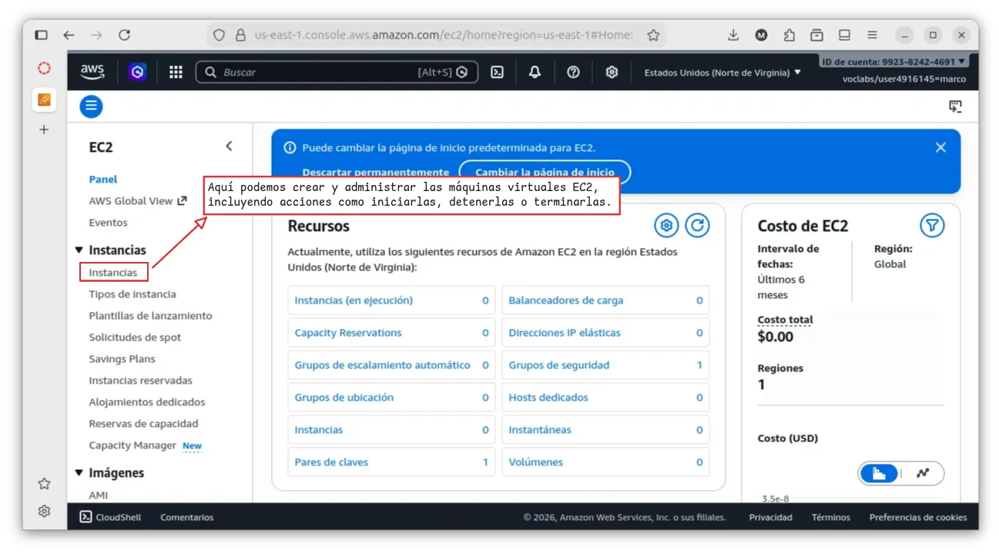
/// caption
**Figura 3**. Panel principal de EC2
///

---

## 3. Creación de la instancia

Dentro del panel de EC2 nos desplazamos hasta encontrar el botón:

<a href="https://us-east-2.console.aws.amazon.com/ec2/home?region=us-east-2#LaunchInstances:" target="_blank" class="border-0"><kbd style="background: #ec7211; color: black">Lanzar la instancia</kbd></a>

Haz clic en el botón para comenzar el asistente de creación y lanzamiento.


/// caption
**Figura 4**. Lanzar una nueva instancia EC2
///

---

## 4. Configurar el nombre

El nombre es simplemente una etiqueta para identificar tu servidor dentro de AWS.

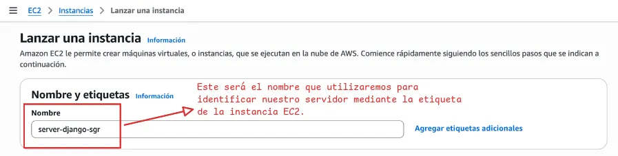
/// caption
**Figura 5**. Definir el nombre o etiqueta del servicio
///

---

## 5. Seleccionar AMI

Luego seleccionar la AMI ( Amazon Machine Image ), que es la plantilla del sistema operativo que se instalará.

Una opción muy cómoda es __Ubuntu Server__, porque es fácil de administrar, es ligero, estable y ampliamente utilizado en servidores.

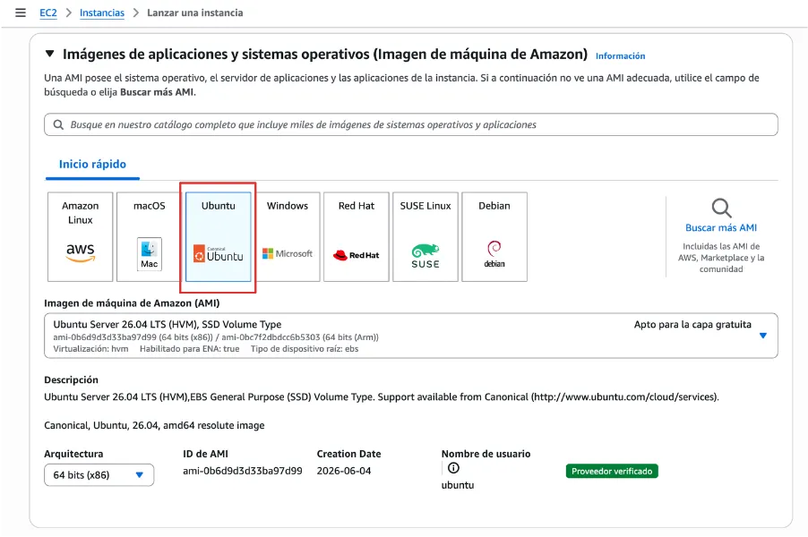
/// caption
**Figura 6**. Seleccionar AMI Ubuntu Server
///

---

## 6. Seleccionar tipo de instancia

El tipo de instancia determina los recursos asignados al servidor, como la CPU y la memoria RAM.

En este caso, seleccionaremos **`t3.micro`**, ya que se encuentra dentro de la capa gratuita y proporciona los recursos necesarios para ejecutar nuestro servidor sin utilizar una configuración de mayor capacidad.

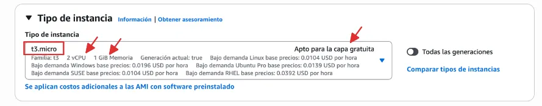
/// caption
**Figura 7**. Seleccionar tipo de instancia t3.micro
///

!!! warning "Cuidado con seleccionar otros tipos"

    Elegir otro tipo de instancia, podría consumir los créditos del laboratorio más rápidamente o incluso no estar permitido por las restricciones del entorno.

---

## 7. Crear par de claves (para conectarse)

El par de claves permite autenticarnos de forma segura al conectarnos a la instancia EC2 mediante SSH. Está compuesto por una **clave pública**, que se almacena en la instancia, y una **clave privada**, que debemos descargar y conservar en un lugar seguro. Esta última es necesaria para establecer la conexión, por lo que **si se pierde, no podremos utilizarla para autenticarnos nuevamente**.

Seleccionaremos **Crear un nuevo par de claves** y configuraremos:

1. **Nombre del par de claves:** un nombre descriptivo para identificarlo.
2. **Tipo de clave:** `RSA`, compatible con instancias Linux y Windows.
3. **Formato del archivo:** `PEM`, para utilizarlo mediante SSH.


/// caption
**Figura 8**. Crear par de claves para conectarse por ssh
///

Al seleccionar **Crear par de claves**, la clave privada se descargará automáticamente como un archivo `.pem`.

!!! warning "AWS no permite descargar nuevamente la clave"

    **Debemos guardarla en un lugar seguro**, ya que AWS no conserva una copia de esta clave y no será posible descargarla nuevamente desde la consola.

    Es recomendable moverla al directorio `~/.ssh/`, destinado al almacenamiento de claves y archivos de configuración utilizados por SSH.

    ```bash title="Terminal"
    mv nombre-clave.pem ~/.ssh/
    ```

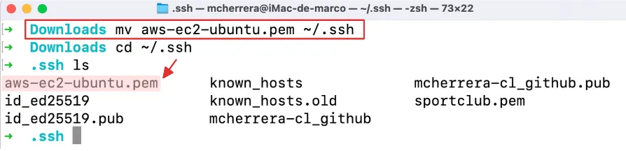
/// caption
**Figura 9**. Mover clave privada a otro destino
///

---

## 8. Configurar las reglas de seguridad

AWS utiliza los __grupos de seguridad__ (*security groups*) para controlar el tráfico de red hacia la instancia.

Las configuraciones más comunes son:

- SSH ( puerto 22 ): para conectarte al servidor
- HTTP ( puerto 80 ): para servidores web
- HTTPS ( puerto 443 ): para tráfico seguro

Para nuestro caso, desplegando Django en una EC2, tiene sentido habilitar las tres reglas de entrada.

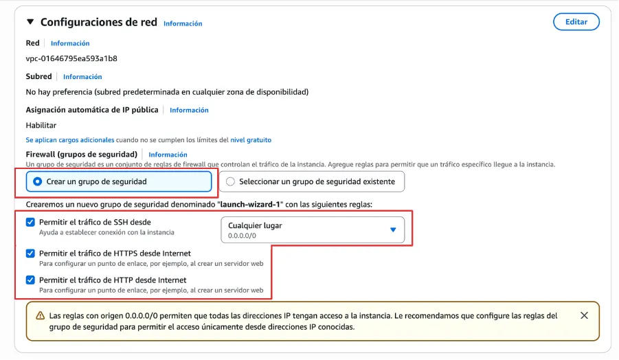
/// caption
**Figura 10**. Configuración de red
///

---

## 9. Lanzar instancia

Una vez configurados los parámetros básicos, haz clic en:

<kbd style="background: #ec7211; color: black">Lanzar la instancia</kbd>


/// caption
**Figura 11**. Crear la instancia configurada
///

El proceso suele tardar menos de un minuto.

---

## 10. Conectarse a la instancia

Cuando el proceso termine, aparecerá una notificación indicando que la instancia se inició correctamente y en ese mismo instante nos muestra la opción “**Conectarse a la instancia**” para acceder a ella.


/// caption
**Figura 12**. Instancia iniciada y lista para conectar
///

Luego, en la pestaña "**En el cliente SSH**", encontraremos las instrucciones y el comando necesario para conectarnos al servidor.


/// caption
**Figura 13**. Instrucciones para conectar por SSH
///

Ahora, debemos ubicarnos en la carpeta donde almacenamos la clave privada y utilizar **SSH** para conectarnos a la instancia mediante dicha clave.

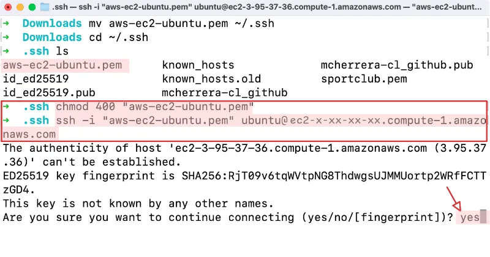
/// caption
**Figura 14**. Realizar primera conexión
///

---

## 11. Instalar y actualizar las dependencias del sistema

Actualizamos e instalamos los paquetes de Python, pip, Nginx y herramientas del sistema:

```bash title="Terminal"
sudo apt update && sudo apt upgrade -y
sudo apt install python3-pip python3-venv nginx git -y
```

<div class="grid cards" markdown>

- 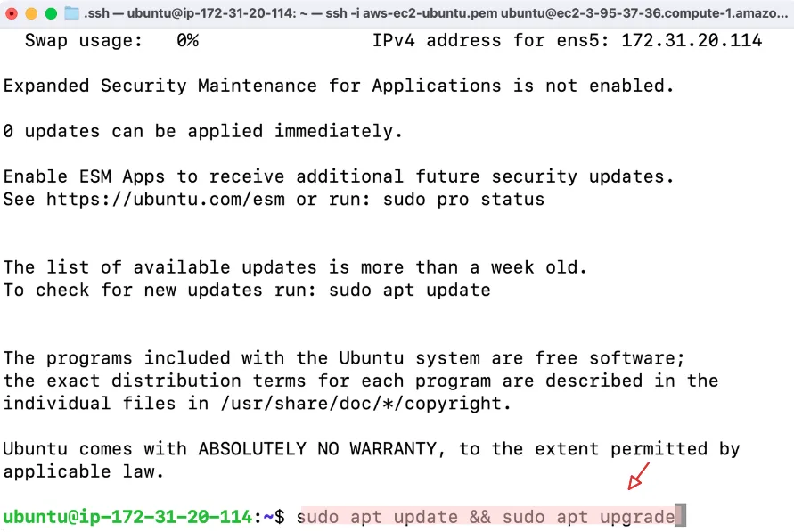
- 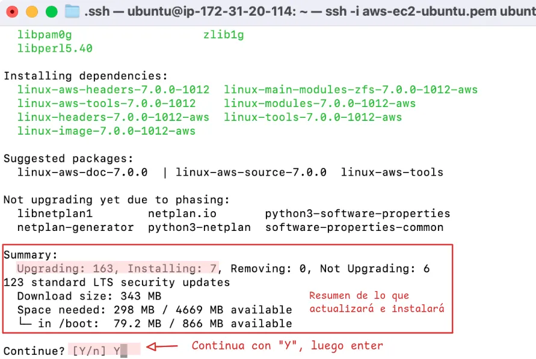
- 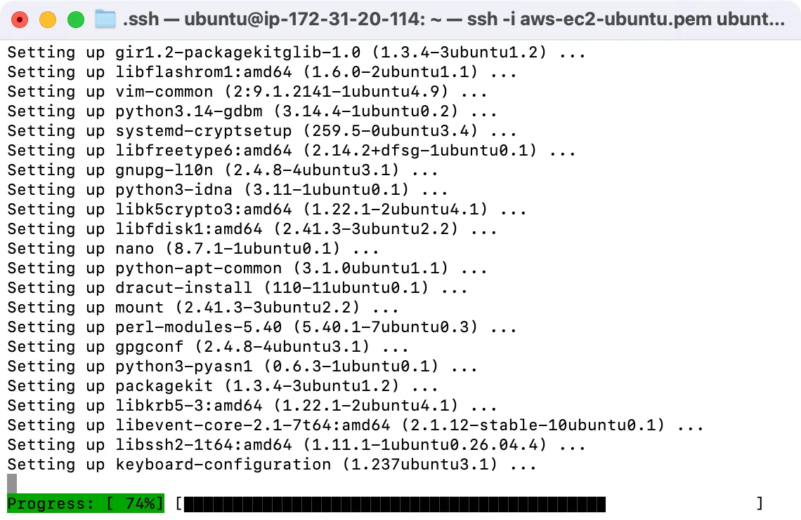
- 

</div>

---


## 12. Configurar el proyecto

- Clonar el repositorio del proyecto.
  
```bash title="Terminal"
git clone url-proyecto
```

- Crear y activar el entorno virtual

```bash title="Terminal"
python3 -m venv .venv
source .venv/bin/activate
```

- Editar el archivo :octicons-file-code-16: `settings.py` para añadir la IP Pública.

```{ .py }
ALLOWED_HOSTS = ['tu-ip-publica']
```

- Ejecuta las migraciones y recopilar los archivos estáticos.

```bash title="Terminal"
python manage.py migrate
python manage.py collectstatic
```

---

## 14. Configurar IP elastica

<div class="grid cards" markdown>

- 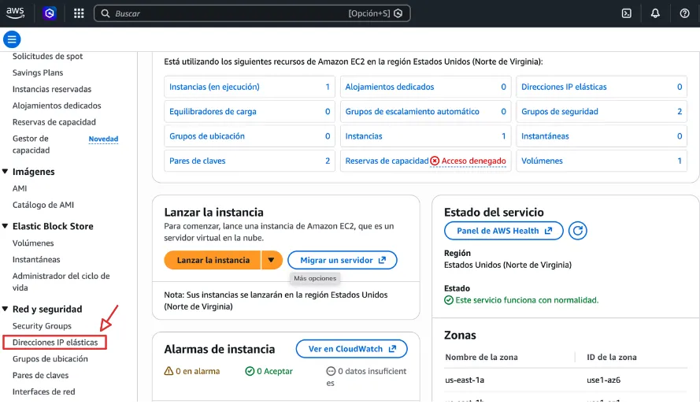
- 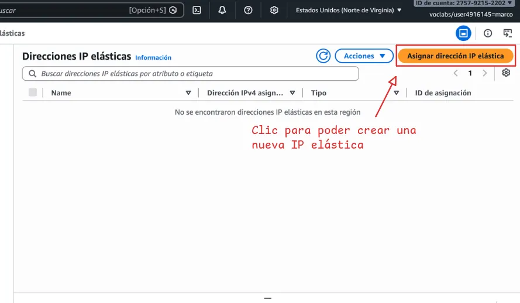

</div>

---

## 14. Configurar Gunicorn como Servicio Systemd

- Creamos un archivo de servicio para que Gunicorn ejecute la aplicación en segundo plano:

```bash title="Terminal"
sudo nano /etc/systemd/system/gunicorn.service
```

- Reemplaza `/ruta/a/tu/proyecto` y `tu_proyecto`

```ini title="gunicorn.service"
[Unit]
Description=gunicorn daemon for Django
After=network.target

[Service]
User=ubuntu
WorkingDirectory=/ruta/a/tu/proyecto
ExecStart=/ruta/a/tu/proyecto/venv/bin/gunicorn \
          --access-logfile - \
          --workers 3 \
          --bind unix:/ruta/a/tu/proyecto/tu_proyecto.sock \
          tu_proyecto.wsgi:application

[Install]
WantedBy=multi-user.target
```

- Instalar y habilitar el servicio

```bash title="Terminal"
sudo systemctl start gunicorn
sudo systemctl enable gunicorn
```

---

## 14. Configurar NGINX como proxy inverso

- Crea un archivo de configuración de Nginx para el sitio.

```bash title="Terminal"
sudo nano /etc/nginx/sites-available/django
```

- Añade el siguiente bloque remplazando los valores para el proyecto.

```nginx title="django"
server {
    listen 80;
    server_name tu-ip-publica-o-dominio;

    location = /favicon.ico { access_log off; log_not_found off; }
    location /static/ {
        alias /ruta/a/tu/proyecto/static/;
    }

    location / {
        include proxy_params;
        proxy_pass http://unix:/ruta/a/tu/proyecto/tu_proyecto.sock;
    }
}
```

- Habilita el sitio y reinicia NGINX.

```bash title="Terminal"
sudo ln -s /etc/nginx/sites-available/django /etc/nginx/sites-enabled/
sudo nginx -t
sudo systemctl restart nginx
```
