!!! abstract "En resumen"

    La infraestructura del proyecto se implementa mediante **AWS Academy**, utilizando una instancia **EC2** como servidor. Sobre esta se configuran **Nginx, Gunicorn y MySQL**, junto con el entorno de Django y sus dependencias necesarias para ejecutar la aplicación.
<!-- more -->

## 1. Abrir la consola de AWS

Desde el portal de [AWS Academy](https://awsacademy.instructure.com/login/canvas){:target="_blank"} iniciamos el AWS Learner Lab para habilitar la consola.

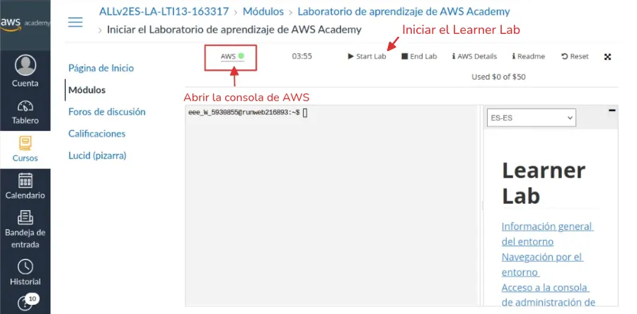
/// caption
**Figura 1**. Iniciar el laboratorio y abrir la consola
///

!!! info
    Cuando el indicador se muestre en color verde, hacemos clic en {++AWS :octicons-circle-16:++} para abrir la consola.

---

## 2. Acceder al servicio EC2

Una vez dentro de la consola, se busca **EC2** en el buscador superior y se selecciona el servicio **Amazon EC2** para ingresar a su panel de administración.

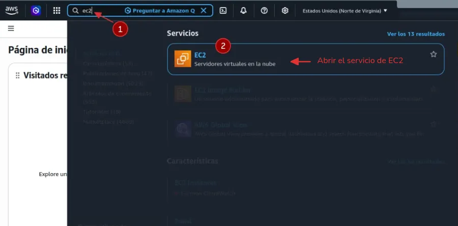
/// caption
**Figura 2**. Seleccionar el servicio de EC2
///

Se abrirá el panel principal de **Amazon EC2**, desde donde se pueden crear, administrar y monitorear las **instancias**.

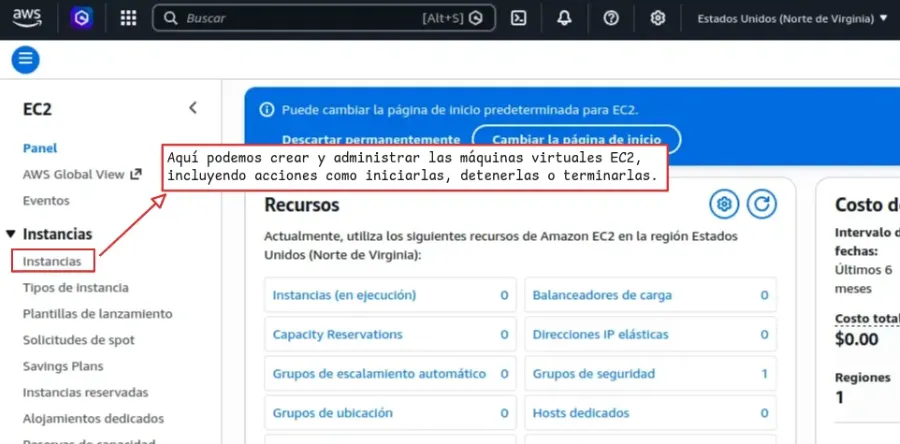
/// caption
**Figura 3**. Panel principal de EC2
///

---

## 3. Lanzar nueva instancia para configurar

Dentro del panel de EC2 nos desplazamos hasta encontrar el botón y hacemos clic en:

<a href="https://us-east-2.console.aws.amazon.com/ec2/home?region=us-east-2#LaunchInstances:" target="_blank" class="border-0"><span class="aws-button" style="cursor: pointer">Lanzar la instancia</span></a>

Para iniciar la configuración.

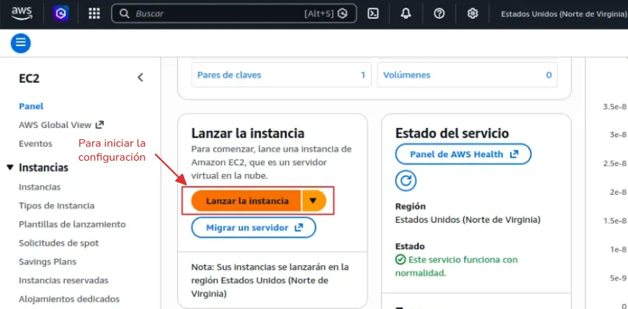
/// caption
**Figura 4**. Lanzar una nueva instancia EC2
///

---

## 4. Configurar el nombre

El nombre es simplemente una etiqueta para identificar esta instancia dentro de AWS.

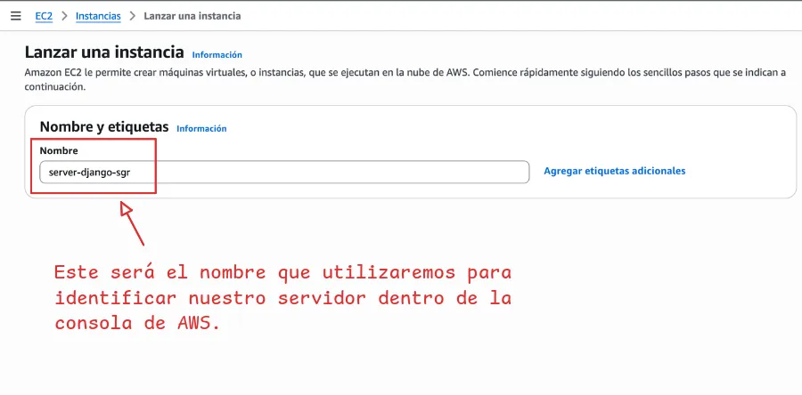
/// caption
**Figura 5**. Definir el nombre o etiqueta de la instancia
///

---

## 5. Seleccionar AMI compatible

Seleccionar una AMI ( Amazon Machine Image ), que es la plantilla del sistema operativo que se instalará.

Una opción muy cómoda es __Ubuntu Server__, porque es fácil de administrar, es ligero, estable y ampliamente utilizado en servidores.

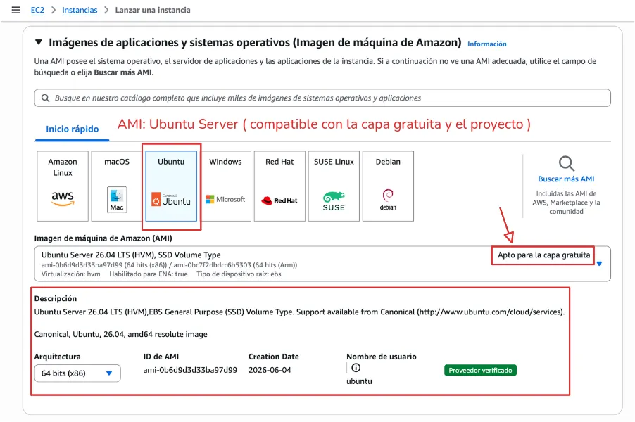
/// caption
**Figura 6**. Seleccionar AMI Ubuntu Server
///

---

## 6. Seleccionar tipo de instancia

El tipo de instancia determina los recursos asignados al servidor, como la CPU y la memoria RAM.

En este caso, seleccionaremos **`t3.micro`**, ya que se encuentra dentro de la capa gratuita y proporciona los recursos necesarios para ejecutar nuestro servidor sin utilizar una configuración de mayor capacidad y mal utilizar los créditos de la cuenta.

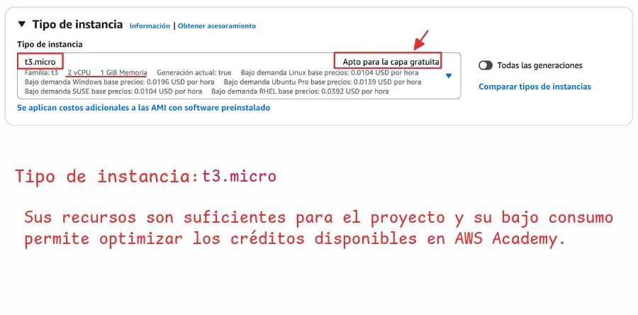
/// caption
**Figura 7**. Seleccionar tipo de instancia t3.micro
///

!!! warning "Cuidado con seleccionar otros tipos"

    Elegir otro tipo de instancia, podría consumir los créditos del laboratorio más rápidamente o incluso no estar permitido por las restricciones del entorno.

---

## 7. Crear par de claves (para conectarse)

El par de claves permite autenticarnos de forma segura al conectarnos a la instancia EC2 mediante SSH. Está compuesto por una **clave pública**, que se almacena en la instancia, y una **clave privada**, que debemos descargar y conservar en un lugar seguro. Esta última es necesaria para establecer la conexión, por lo que **si se pierde, no podremos utilizarla para autenticarnos nuevamente**.

Seleccionaremos **Crear un nuevo par de claves** y configuraremos:

1. **Nombre del par de claves:** un nombre descriptivo para identificarlo.
2. **Tipo de clave:** `RSA`, compatible con instancias Linux y Windows.
3. **Formato del archivo:** `PEM`, para utilizarlo mediante SSH.

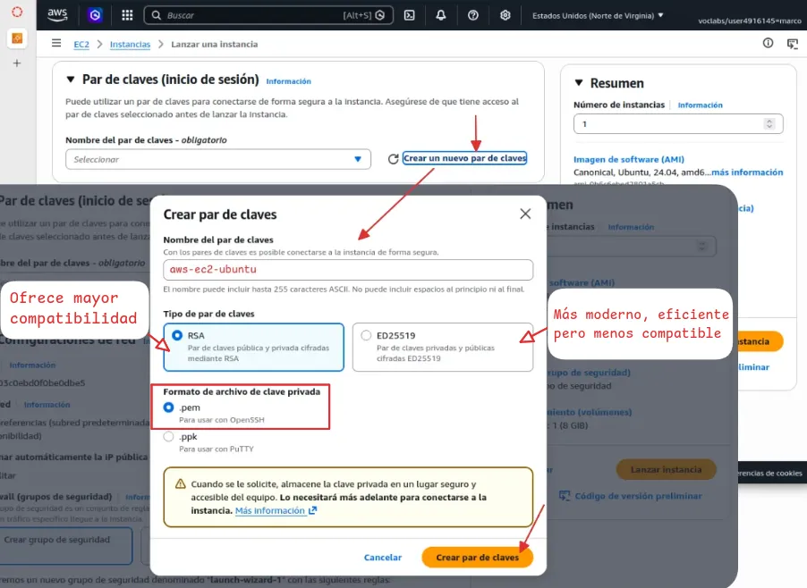
/// caption
**Figura 8**. Crear par de claves para conectarse por ssh
///

Al seleccionar **Crear par de claves**, la clave privada se descargará automáticamente como un archivo `.pem`.

???+ warning "AWS no permite descargar nuevamente la clave"

    **Debemos guardarla en un lugar seguro**, ya que AWS no conserva una copia de esta clave y no será posible descargarla nuevamente desde la consola.

    Es recomendable moverla al directorio `~/.ssh/`, destinado al almacenamiento de claves y archivos de configuración utilizados por SSH.

    ```bash title="Terminal"
    mv nombre-clave.pem ~/.ssh/
    ```

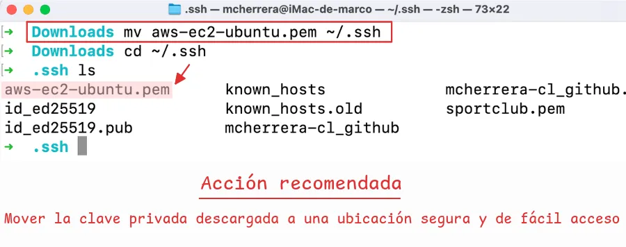
/// caption
**Figura 9**. Mover clave privada a otro destino
///

---

## 8. Configuración de red y acceso

AWS utiliza los **grupos de seguridad** (*security groups*) para controlar el tráfico de red hacia la instancia.

Las configuraciones más comunes son:

- SSH ( puerto 22 ): para conectarte al servidor
- HTTP ( puerto 80 ): para servidores web
- HTTPS ( puerto 443 ): para tráfico seguro

Para nuestro caso, desplegando Django en una EC2, tiene sentido habilitar las tres reglas de entrada.

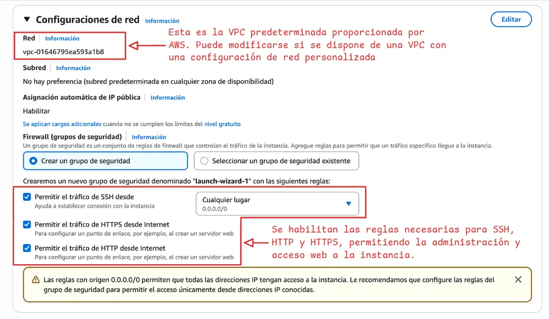
/// caption
**Figura 10**. Configuración de red y reglas de acceso
///

---

## 9. Lanzar instancia

Finalmente, se deja el almacenamiento con los parámetros básicos y se hace clic en:

<span class="aws-button">Lanzar la instancia</span>

El proceso suele tardar menos de un minuto.

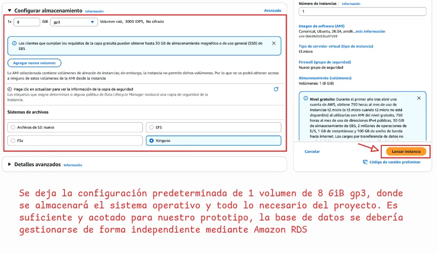
/// caption
**Figura 11**. Lanzar instancia
///

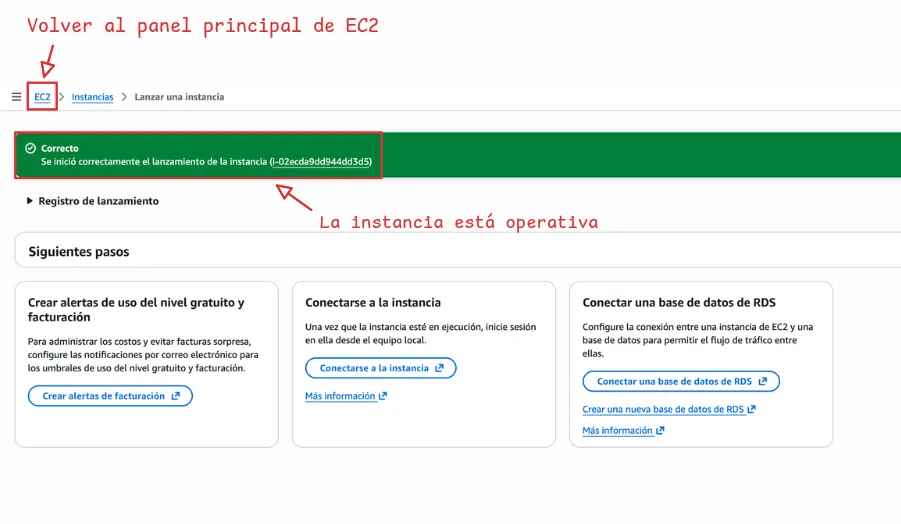
/// caption
**Figura 12**. Instancia operativa
///

Una vez lanzada la instancia, el siguiente paso será volver al panel de **EC2** para configurar una **IP elástica**.

---

## 10. Configurar y asignar una IP elástica

Este paso es clave porque la IP del EC2 cambia cada vez que se apaga o se reinicia. Hay que configurar y asignar una IP elástica (fija) para evitar que se caigan los servicios y para luego conectar por SSH siempre a la misma IP sin andar cambiándola a cada rato.

En el panel de EC2, se baja hasta la sección **Direcciones IP elásticas** para continuar con la configuración.


/// caption
**Figura 13**. Acceder a Direcciones IP elásticas
///

Luego, se hace clic en:

<span class="aws-button">Asignar dirección IP elástica</span>

Esto abrirá el formulario para configurar la nueva dirección IP.


/// caption
**Figura 14**. Asignar nueva dirección IP elástica
///

Se mantiene la configuración predeterminada y se hace clic en:

<span class="aws-button">Asignar</span>

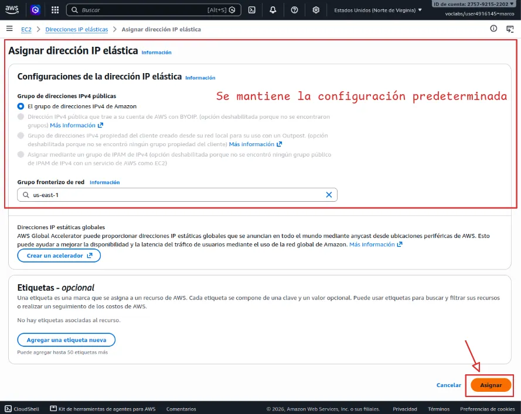
/// caption
**Figura 15**. Configurar y asignar
///

Una vez asignada la **IP elástica**, se hace clic sobre la IP para acceder a sus opciones.

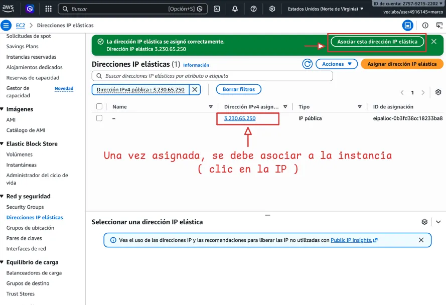
/// caption
**Figura 16**. Acceder a las opciones de la IP asignada
///

Dentro de sus opciones, se hace clic en:

<span class="aws-button">Dirección IP elástica asociada</span>

Para ingresar y vincularla a la instancia **EC2**.

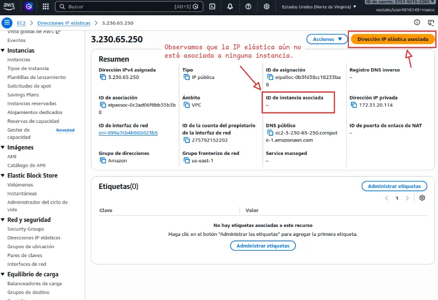
/// caption
**Figura 17**. Abrir el formulario para asociar esta IP elástica
///

En el formulario, se busca la instancia y se hace clic en:

<span class="aws-button">Asociado</span>

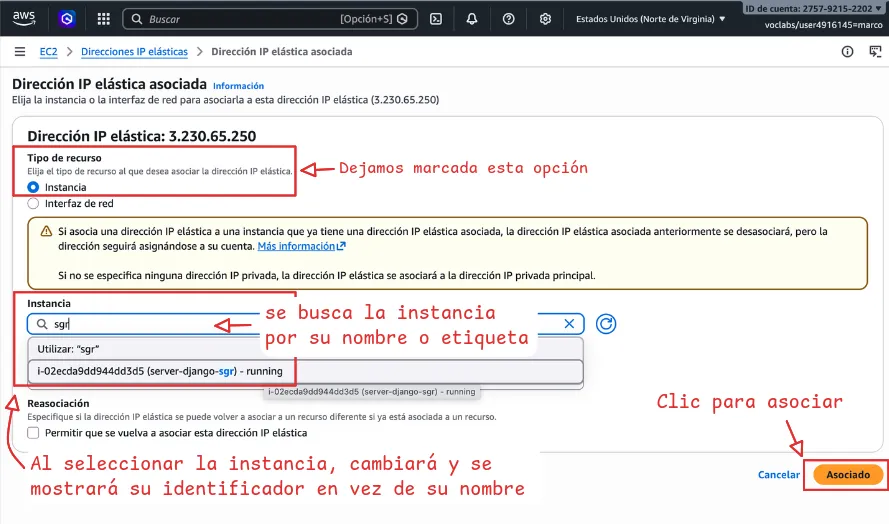
/// caption
**Figura 18**. Seleccionar instancia y asociar
///

---

## 11. Conectarse a la instancia

Con una IP elástica asociada a la instancia, la conexión será más sencilla, ya que se mantendrá la misma dirección IP para las conexiones futuras.

Ahora volvemos al panel principal de EC2 para acceder a la instancia.

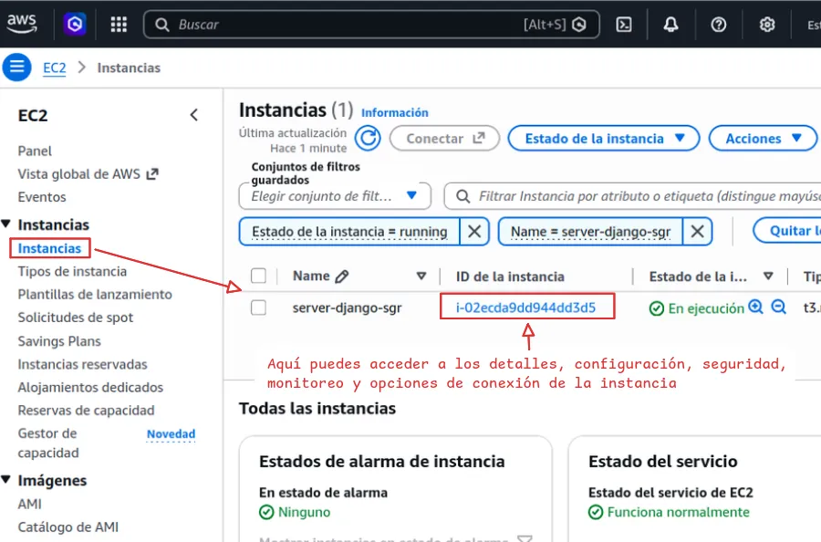
/// caption
**Figura 19**. Ingresar a los detalles de la instancia
///

Ahora, hacemos clic en **Conectar** para acceder a las opciones de conexión de la instancia.

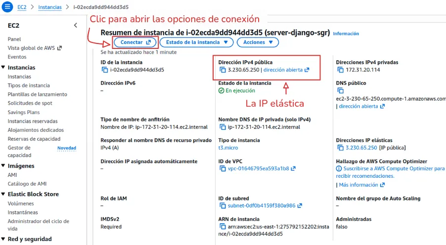
/// caption
**Figura 20**. Instrucciones para conectar por SSH
///

Como podemos observar, la instancia muestra la **IP elástica** que asignamos previamente.

Luego, en la pestaña **En el cliente SSH**, encontraremos las instrucciones y el comando necesario para conectarnos al servidor.

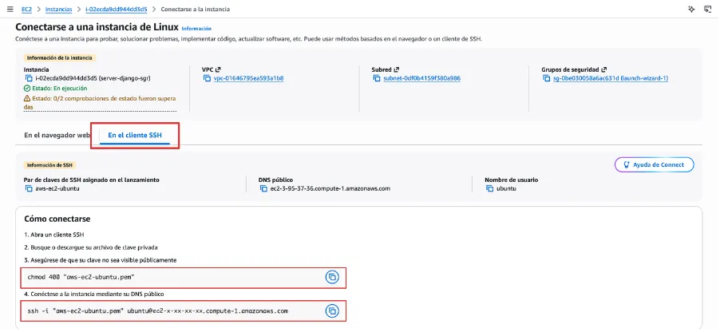
/// caption
**Figura 21**. Instrucciones para conectar por SSH
///

Ahora, debemos ubicarnos en la carpeta donde almacenamos la clave privada y utilizar **SSH** para conectarnos a la instancia mediante dicha clave.


/// caption
**Figura 22**. Realizar primera conexión a la instancia
///

---

## 11. Instalar y actualizar las herramientas del sistema

Actualizamos los paquetes del sistema e instalamos Python, pip, el entorno virtual y Git.

```bash title="Terminal"
sudo apt update && sudo apt upgrade -y  # (1)!
```

1. Actualiza los paquetes del sistema.


/// caption
**Figura 23**. Actualización de los paquetes del sistema
///

A continuación, instalamos las herramientas necesarias: Python, el paquete para gestionar entornos virtuales y Git.

```bash title="Terminal"
sudo apt install python3-pip python3-venv git -y  # (1)!
```

1. Instala Python, pip, entornos virtuales y Git.

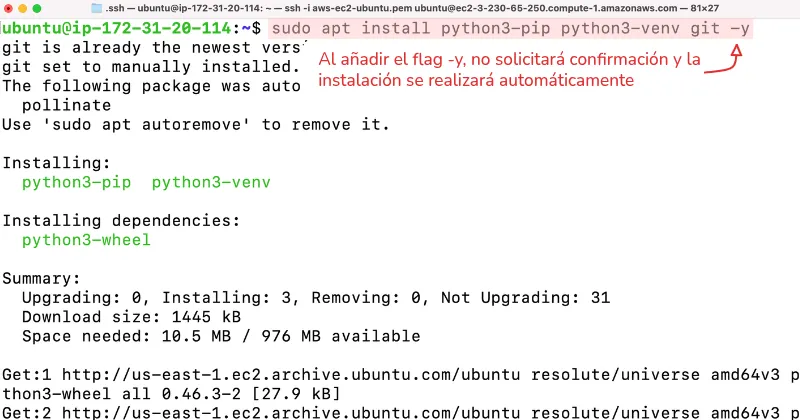
/// caption
**Figura 24**. Instalación de las herramientas necesarias
///

Luego, verificamos las versiones instaladas para comprobar que las herramientas se hayan instalado correctamente.

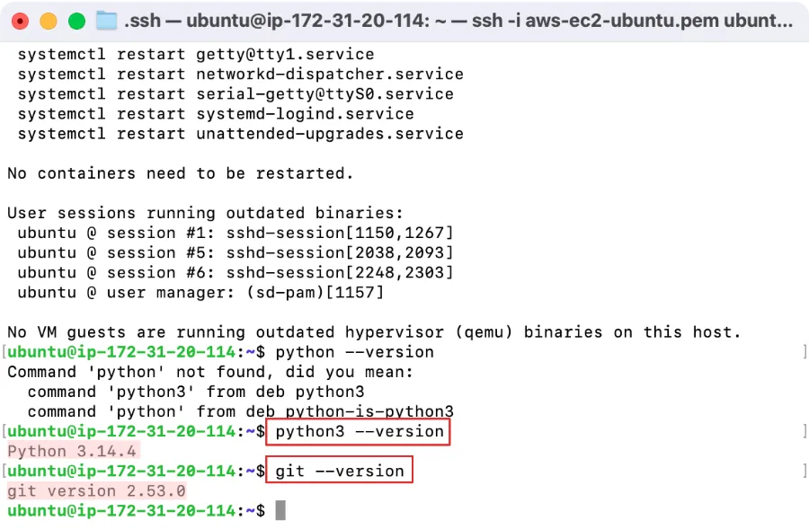
/// caption
**Figura 25**. Verificar las versiones de las herramientas
///

---

## 12. Configurar el proyecto

Se crea `/var/www` para alojar el proyecto web y se asignan permisos al usuario actual para trabajar con sus archivos.

```bash title="Terminal"
sudo mkdir -p /var/www  # (1)!
sudo chown -R $USER:$USER /var/www  # (2)!
```

1. Crea el directorio `/var/www`, donde se alojará el proyecto web.
2. Asigna `/var/www` al usuario actual para permitirle crear y modificar archivos sin privilegios de administrador.

???+ info "Ubicación del proyecto"
    Aunque el proyecto puede ubicarse en cualquier directorio, `/var/www` es una ubicación habitual para alojar aplicaciones web en servidores Linux.

    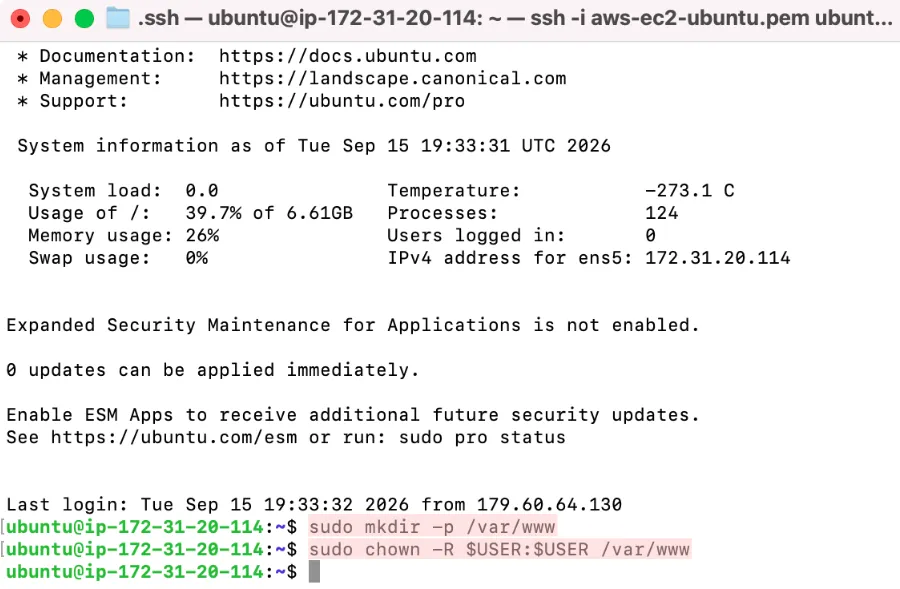

A continuación, se accede al directorio `/var/www` y se clona el repositorio del proyecto.

```bash title="Terminal"
cd /var/www
git clone https://github.com/usuario/proyecto-sgr-delegaciones.git
```

Se crea y activa un entorno virtual para aislar las dependencias del proyecto.

```bash title="Terminal"
python3 -m venv .venv
source .venv/bin/activate
```

- Editar el archivo :octicons-file-code-16: `settings.py` para añadir la IP Pública.

```{ .py }
ALLOWED_HOSTS = ['tu-ip-publica']
```

- Ejecuta las migraciones y recopilar los archivos estáticos.

```bash title="Terminal"
python manage.py migrate
python manage.py collectstatic
```

---

## 13. Configurar Gunicorn como Servicio Systemd

- Creamos un archivo de servicio para que Gunicorn ejecute la aplicación en segundo plano:

```bash title="Terminal"
sudo nano /etc/systemd/system/gunicorn.service
```

- Reemplaza `/ruta/a/tu/proyecto` y `tu_proyecto`

```ini title="gunicorn.service"
[Unit]
Description=gunicorn daemon for Django
After=network.target

[Service]
User=ubuntu
WorkingDirectory=/ruta/a/tu/proyecto
ExecStart=/ruta/a/tu/proyecto/venv/bin/gunicorn \
          --access-logfile - \
          --workers 3 \
          --bind unix:/ruta/a/tu/proyecto/tu_proyecto.sock \
          tu_proyecto.wsgi:application

[Install]
WantedBy=multi-user.target
```

- Instalar y habilitar el servicio

```bash title="Terminal"
sudo systemctl start gunicorn
sudo systemctl enable gunicorn
```

---

## 14. Configurar NGINX como proxy inverso

- Crea un archivo de configuración de Nginx para el sitio.

```bash title="Terminal"
sudo nano /etc/nginx/sites-available/django
```

- Añade el siguiente bloque remplazando los valores para el proyecto.

```nginx title="django"
server {
    listen 80;
    server_name tu-ip-publica-o-dominio;

    location = /favicon.ico { access_log off; log_not_found off; }
    location /static/ {
        alias /ruta/a/tu/proyecto/static/;
    }

    location / {
        include proxy_params;
        proxy_pass http://unix:/ruta/a/tu/proyecto/tu_proyecto.sock;
    }
}
```

- Habilita el sitio y reinicia NGINX.

```bash title="Terminal"
sudo ln -s /etc/nginx/sites-available/django /etc/nginx/sites-enabled/
sudo nginx -t
sudo systemctl restart nginx
```
