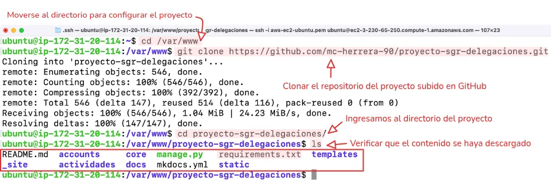
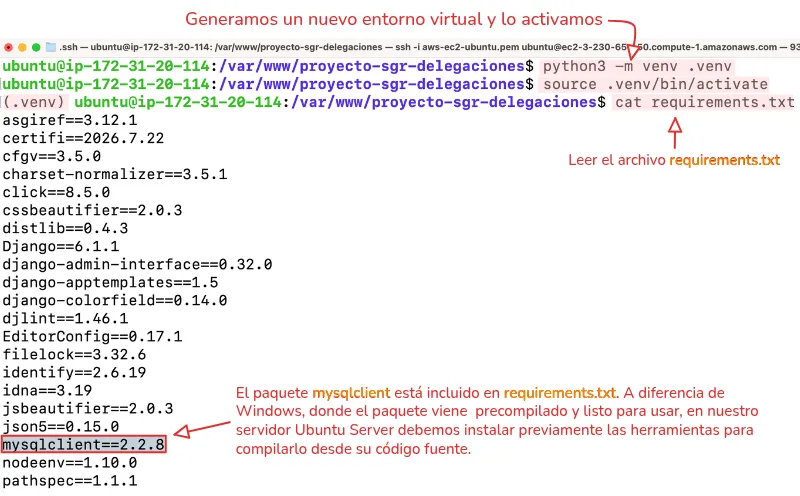
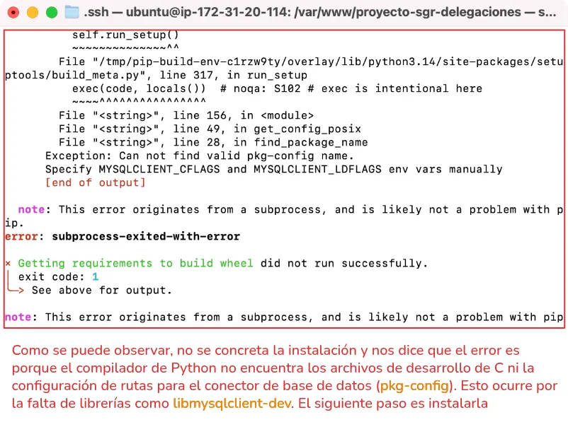
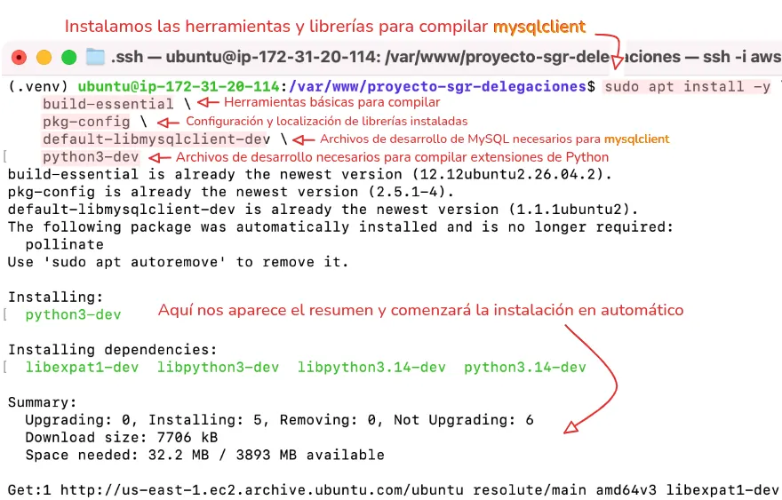

!!! abstract "En resumen"

    La infraestructura del proyecto se implementa mediante **AWS Academy**, utilizando una instancia **EC2** como servidor. Sobre esta se configuran **Nginx, Gunicorn y MySQL**, junto con el entorno de Django y sus dependencias necesarias para ejecutar la aplicación.
<!-- more -->

## 1. Abrir la consola de AWS

Desde el portal de [AWS Academy](https://awsacademy.instructure.com/login/canvas){:target="_blank"} iniciamos el AWS Learner Lab para habilitar la consola.


/// caption
**Figura 1**. Iniciar el laboratorio y abrir la consola
///

!!! info
    Cuando el indicador se muestre en color verde, hacemos clic en {++AWS :octicons-circle-16:++} para abrir la consola.

---

## 2. Acceder al servicio EC2

Una vez dentro de la consola, se busca **EC2** en el buscador superior y se selecciona el servicio **Amazon EC2** para ingresar a su panel de administración.


/// caption
**Figura 2**. Seleccionar el servicio de EC2
///

Se abrirá el panel principal de **Amazon EC2**, desde donde se pueden crear, administrar y monitorear las **instancias**.


/// caption
**Figura 3**. Panel principal de EC2
///

---

## 3. Lanzar nueva instancia para configurar

Dentro del panel de EC2 nos desplazamos hasta encontrar el botón y hacemos clic en:

<a href="https://us-east-2.console.aws.amazon.com/ec2/home?region=us-east-2#LaunchInstances:" target="_blank" class="border-0"><span class="aws-button" style="cursor: pointer">Lanzar la instancia</span></a>

Para iniciar la configuración.


/// caption
**Figura 4**. Lanzar una nueva instancia EC2
///

---

## 4. Configurar el nombre

El nombre es simplemente una etiqueta para identificar esta instancia dentro de AWS.


/// caption
**Figura 5**. Definir el nombre o etiqueta de la instancia
///

---

## 5. Seleccionar AMI compatible

Seleccionar una AMI ( Amazon Machine Image ), que es la plantilla del sistema operativo que se instalará.

Una opción muy cómoda es __Ubuntu Server__, porque es fácil de administrar, es ligero, estable y ampliamente utilizado en servidores.


/// caption
**Figura 6**. Seleccionar AMI Ubuntu Server
///

---

## 6. Seleccionar tipo de instancia

El tipo de instancia determina los recursos asignados al servidor, como la CPU y la memoria RAM.

En este caso, seleccionaremos **`t3.micro`**, ya que se encuentra dentro de la capa gratuita y proporciona los recursos necesarios para ejecutar nuestro servidor sin utilizar una configuración de mayor capacidad y mal utilizar los créditos de la cuenta.


/// caption
**Figura 7**. Seleccionar tipo de instancia t3.micro
///

!!! warning "Cuidado con seleccionar otros tipos"

    Elegir otro tipo de instancia, podría consumir los créditos del laboratorio más rápidamente o incluso no estar permitido por las restricciones del entorno.

---

## 7. Crear par de claves (para conectarse)

El par de claves permite autenticarnos de forma segura al conectarnos a la instancia EC2 mediante SSH. Está compuesto por una **clave pública**, que se almacena en la instancia, y una **clave privada**, que debemos descargar y conservar en un lugar seguro. Esta última es necesaria para establecer la conexión, por lo que **si se pierde, no podremos utilizarla para autenticarnos nuevamente**.

Seleccionaremos **Crear un nuevo par de claves** y configuraremos:

1. **Nombre del par de claves:** un nombre descriptivo para identificarlo.
2. **Tipo de clave:** `RSA`, compatible con instancias Linux y Windows.
3. **Formato del archivo:** `PEM`, para utilizarlo mediante SSH.


/// caption
**Figura 8**. Crear par de claves para conectarse por ssh
///

Al seleccionar **Crear par de claves**, la clave privada se descargará automáticamente como un archivo `.pem`.

???+ warning "AWS no permite descargar nuevamente la clave"

    **Debemos guardarla en un lugar seguro**, ya que AWS no conserva una copia de esta clave y no será posible descargarla nuevamente desde la consola.

    Es recomendable moverla al directorio `~/.ssh/`, destinado al almacenamiento de claves y archivos de configuración utilizados por SSH.

    ```bash title="Terminal"
    mv nombre-clave.pem ~/.ssh/
    ```


/// caption
**Figura 9**. Mover clave privada a otro destino
///

---

## 8. Configuración de red y acceso

AWS utiliza los **grupos de seguridad** (*security groups*) para controlar el tráfico de red hacia la instancia.

Las configuraciones más comunes son:

- SSH ( puerto 22 ): para conectarte al servidor
- HTTP ( puerto 80 ): para servidores web
- HTTPS ( puerto 443 ): para tráfico seguro

Para nuestro caso, desplegando Django en una EC2, tiene sentido habilitar las tres reglas de entrada.


/// caption
**Figura 10**. Configuración de red y reglas de acceso
///

---

## 9. Lanzar instancia

Finalmente, se deja el almacenamiento con los parámetros básicos y se hace clic en:

<span class="aws-button">Lanzar la instancia</span>

El proceso suele tardar menos de un minuto.


/// caption
**Figura 11**. Lanzar instancia
///


/// caption
**Figura 12**. Instancia operativa
///

Una vez lanzada la instancia, el siguiente paso será volver al panel de **EC2** para configurar una **IP elástica**.

---

## 10. Configurar y asignar una IP elástica

Este paso es clave porque la IP del EC2 cambia cada vez que se apaga o se reinicia. Hay que configurar y asignar una IP elástica (fija) para evitar que se caigan los servicios y para luego conectar por SSH siempre a la misma IP sin andar cambiándola a cada rato.

En el panel de EC2, se baja hasta la sección **Direcciones IP elásticas** para continuar con la configuración.


/// caption
**Figura 13**. Acceder a Direcciones IP elásticas
///

Luego, se hace clic en:

<span class="aws-button">Asignar dirección IP elástica</span>

Esto abrirá el formulario para configurar la nueva dirección IP.


/// caption
**Figura 14**. Asignar nueva dirección IP elástica
///

Se mantiene la configuración predeterminada y se hace clic en:

<span class="aws-button">Asignar</span>


/// caption
**Figura 15**. Configurar y asignar
///

Una vez asignada la **IP elástica**, se hace clic sobre la IP para acceder a sus opciones.


/// caption
**Figura 16**. Acceder a las opciones de la IP asignada
///

Dentro de sus opciones, se hace clic en:

<span class="aws-button">Dirección IP elástica asociada</span>

Para ingresar y vincularla a la instancia **EC2**.


/// caption
**Figura 17**. Abrir el formulario para asociar esta IP elástica
///

En el formulario, se busca la instancia y se hace clic en:

<span class="aws-button">Asociado</span>


/// caption
**Figura 18**. Seleccionar instancia y asociar
///

---

## 11. Conectarse a la instancia

Con una IP elástica asociada a la instancia, la conexión será más sencilla, ya que se mantendrá la misma dirección IP para las conexiones futuras.

Ahora volvemos al panel principal de EC2 para acceder a la instancia.


/// caption
**Figura 19**. Ingresar a los detalles de la instancia
///

Ahora, hacemos clic en **Conectar** para acceder a las opciones de conexión de la instancia.


/// caption
**Figura 20**. Instrucciones para conectar por SSH
///

Como podemos observar, la instancia muestra la **IP elástica** que asignamos previamente.

Luego, en la pestaña **En el cliente SSH**, encontraremos las instrucciones y el comando necesario para conectarnos al servidor.


/// caption
**Figura 21**. Instrucciones para conectar por SSH
///

Ahora, debemos ubicarnos en la carpeta donde almacenamos la clave privada y utilizar **SSH** para conectarnos a la instancia mediante dicha clave.


/// caption
**Figura 22**. Realizar primera conexión a la instancia
///

---

## 11. Instalar y actualizar las herramientas del sistema

Actualizamos los paquetes del sistema e instalamos Python, pip, el entorno virtual y Git.

```bash title="Terminal"
sudo apt update && sudo apt upgrade -y  # (1)!
```

1. Actualiza los paquetes del sistema.


/// caption
**Figura 23**. Actualización de los paquetes del sistema
///

A continuación, instalamos las herramientas necesarias: Python, el paquete para gestionar entornos virtuales y Git.

```bash title="Terminal"
sudo apt install python3-pip python3-venv git -y  # (1)!
```

1. Instala Python, pip, entornos virtuales y Git.


/// caption
**Figura 24**. Instalación de las herramientas necesarias
///

Luego, verificamos las versiones instaladas para comprobar que las herramientas se hayan instalado correctamente.


/// caption
**Figura 25**. Verificar las versiones de las herramientas
///

---

## 12. Configurar inicial del proyecto

Se crea el directorio `/var/www` para alojar el proyecto web y se asignan permisos al usuario actual para trabajar con sus archivos.

```bash title="Terminal"
sudo mkdir -p /var/www  # (1)!
sudo chown -R $USER:$USER /var/www  # (2)!
```

1. Crea el directorio `/var/www`, donde se alojará el proyecto web.
2. Asigna `/var/www` al usuario actual para permitirle crear y modificar archivos sin privilegios de administrador.

???+ info "Ubicación del proyecto"
    Aunque el proyecto puede ubicarse en cualquier directorio, `/var/www` es una ubicación habitual para alojar aplicaciones web en servidores Linux.

    

A continuación, se accede al directorio `/var/www` y se clona el repositorio del proyecto.

```bash title="Terminal"
cd /var/www
git clone https://github.com/usuario/proyecto-sgr-delegaciones.git
```


/// caption
**Figura 26**. Clonar proyecto desde GitHub
///

Se crea y activa un entorno virtual para aislar las dependencias del proyecto.

```bash title="Terminal"
python3 -m venv .venv
source .venv/bin/activate
```


/// caption
**Figura 27**. Preparar entorno virtual y ver archivo requirements.txt
///

Luego, al intentar instalar las dependencias del archivo :octicons-file-16: `requirements.txt`, si no contamos con las herramientas y librerías necesarias para compilar `mysqlclient`, se producirá un error.

=== "Comando"

    ```bash
    (.venv) pip install -r requirements.txt
    ```
=== "Output"

    ```{ .bash .no-copy }
    Collecting asgiref==3.12.1 (from -r requirements.txt (line 1))
    Downloading asgiref-3.12.1-py3-none-any.whl.metadata (9.4 kB)
    Collecting certifi==2026.7.22 (from -r requirements.txt (line 2))
    Downloading certifi-2026.7.22-py3-none-any.whl.metadata (2.5 kB)
    Collecting cfgv==3.5.0 (from -r requirements.txt (line 3))
    Downloading cfgv-3.5.0-py2.py3-none-any.whl.metadata (8.9 kB)
    Collecting charset-normalizer==3.5.1 (from -r requirements.txt (line 4))
    Downloading charset_normalizer-3.5.1-cp314-cp314-manylinux2014_x86_64.manylinux_2_17_x86_64.manylinux_2_28_x86_64.whl.metadata (45 kB)
    Collecting click==8.5.0 (from -r requirements.txt (line 5))
    Downloading click-8.5.0-py3-none-any.whl.metadata (2.6 kB)
    Collecting cssbeautifier==2.0.3 (from -r requirements.txt (line 6))
    Downloading cssbeautifier-2.0.3-py3-none-any.whl.metadata (459 bytes)
    Collecting distlib==0.4.3 (from -r requirements.txt (line 7))
    Downloading distlib-0.4.3-py2.py3-none-any.whl.metadata (5.3 kB)
    Collecting Django==6.1.1 (from -r requirements.txt (line 8))
    Downloading django-6.1.1-py3-none-any.whl.metadata (3.9 kB)
    Collecting django-admin-interface==0.32.0 (from -r requirements.txt (line 9))
    Downloading django_admin_interface-0.32.0-py3-none-any.whl.metadata (17 kB)
    Collecting django-apptemplates==1.5 (from -r requirements.txt (line 10))
    Downloading django-apptemplates-1.5.tar.gz (5.1 kB)
    Installing build dependencies ... done
    Getting requirements to build wheel ... done
    Preparing metadata (pyproject.toml) ... done
    Collecting django-colorfield==0.14.0 (from -r requirements.txt (line 11))
    Downloading django_colorfield-0.14.0-py3-none-any.whl.metadata (11 kB)
    Collecting djlint==1.46.1 (from -r requirements.txt (line 12))
    Downloading djlint-1.46.1-cp314-cp314-manylinux2014_x86_64.manylinux_2_17_x86_64.manylinux_2_28_x86_64.whl.metadata (9.1 kB)
    Collecting EditorConfig==0.17.1 (from -r requirements.txt (line 13))
    Downloading editorconfig-0.17.1-py3-none-any.whl.metadata (3.9 kB)
    Collecting filelock==3.32.6 (from -r requirements.txt (line 14))
    Downloading filelock-3.32.6-py3-none-any.whl.metadata (2.0 kB)
    Collecting identify==2.6.19 (from -r requirements.txt (line 15))
    Downloading identify-2.6.19-py2.py3-none-any.whl.metadata (4.4 kB)
    Collecting idna==3.19 (from -r requirements.txt (line 16))
    Downloading idna-3.19-py3-none-any.whl.metadata (9.2 kB)
    Collecting jsbeautifier==2.0.3 (from -r requirements.txt (line 17))
    Downloading jsbeautifier-2.0.3-py3-none-any.whl.metadata (481 bytes)
    Collecting json5==0.15.0 (from -r requirements.txt (line 18))
    Downloading json5-0.15.0-py3-none-any.whl.metadata (37 kB)
    Collecting mysqlclient==2.2.8 (from -r requirements.txt (line 19))
    Downloading mysqlclient-2.2.8.tar.gz (92 kB)
    Installing build dependencies ... done
    Getting requirements to build wheel ... error
    error: subprocess-exited-with-error
    
    × Getting requirements to build wheel did not run successfully.
    │ exit code: 1
    ╰─> [35 lines of output]
        /bin/sh: 1: pkg-config: not found
        /bin/sh: 1: pkg-config: not found
        /bin/sh: 1: pkg-config: not found
        /bin/sh: 1: pkg-config: not found
        Trying pkg-config --exists mysqlclient
        Command 'pkg-config --exists mysqlclient' returned non-zero exit status 127.
        Trying pkg-config --exists mariadb
        Command 'pkg-config --exists mariadb' returned non-zero exit status 127.
        Trying pkg-config --exists libmariadb
        Command 'pkg-config --exists libmariadb' returned non-zero exit status 127.
        Trying pkg-config --exists perconaserverclient
        Command 'pkg-config --exists perconaserverclient' returned non-zero exit status 127.
        Traceback (most recent call last):
            File "/var/www/proyecto-sgr-delegaciones/.venv/lib/python3.14/site-packages/pip/_vendor/pyproject_hooks/_in_process/_in_process.py", line 389, in <module>
            main()
            ~~~~^^
            File "/var/www/proyecto-sgr-delegaciones/.venv/lib/python3.14/site-packages/pip/_vendor/pyproject_hooks/_in_process/_in_process.py", line 373, in main
            json_out["return_val"] = hook(**hook_input["kwargs"])
                                    ~~~~^^^^^^^^^^^^^^^^^^^^^^^^
            File "/var/www/proyecto-sgr-delegaciones/.venv/lib/python3.14/site-packages/pip/_vendor/pyproject_hooks/_in_process/_in_process.py", line 143, in get_requires_for_build_wheel
            return hook(config_settings)
            File "/tmp/pip-build-env-14gdpasp/overlay/lib/python3.14/site-packages/setuptools/build_meta.py", line 333, in get_requires_for_build_wheel
            return self._get_build_requires(config_settings, requirements=[])
                    ~~~~~~~~~~~~~~~~~~~~~~~~^^^^^^^^^^^^^^^^^^^^^^^^^^^^^^^^^^
            File "/tmp/pip-build-env-14gdpasp/overlay/lib/python3.14/site-packages/setuptools/build_meta.py", line 301, in _get_build_requires
            self.run_setup()
            ~~~~~~~~~~~~~~^^
            File "/tmp/pip-build-env-14gdpasp/overlay/lib/python3.14/site-packages/setuptools/build_meta.py", line 317, in run_setup
            exec(code, locals())  # noqa: S102 # exec is intentional here
            ~~~~^^^^^^^^^^^^^^^^
            File "<string>", line 156, in <module>
            File "<string>", line 49, in get_config_posix
            File "<string>", line 28, in find_package_name
        Exception: Can not find valid pkg-config name.
        Specify MYSQLCLIENT_CFLAGS and MYSQLCLIENT_LDFLAGS env vars manually
        [end of output]
    
    note: This error originates from a subprocess, and is likely not a problem with pip.
    error: subprocess-exited-with-error

    × Getting requirements to build wheel did not run successfully.
    │ exit code: 1
    ╰─> See above for output.

    note: This error originates from a subprocess, and is likely not a problem with pip.
    ```


/// caption
**Figura 28**. Error al instalar las dependencias de mysqlclient
///

Para solucionarlo, procedemos a instalar las herramientas necesarias para compilar el driver de conexión.

=== "Comando"

    ```python
    (.venv) sudo apt install -y \
    build-essential \#(1)!
    pkg-config \#(2)!
    default-libmysqlclient-dev \#(3)!
    python3-dev \#(4)!
    ```

    1. Herramientas necesarias para compilar paquetes.
    2. Herramienta para gestionar la configuración de compilación.
    3. Archivos de desarrollo necesarios para compilar `mysqlclient`.
    4. Archivos de desarrollo de Python necesarios para compilar extensiones.

=== "Output"

    ```{ .bash .no-copy }
    build-essential is already the newest version (12.12ubuntu2.26.04.2).
    build-essential set to manually installed.
    The following package was automatically installed and is no longer required:
    pollinate
    Use 'sudo apt autoremove' to remove it.

    Installing:
    default-libmysqlclient-dev  pkg-config

    Installing dependencies:
    libmysqlclient-dev  libpkgconf7  libzstd-dev   pkgconf
    libmysqlclient24    libssl-dev   mysql-common  pkgconf-bin

    Suggested packages:
    libssl-doc

    Summary:
    Upgrading: 0, Installing: 10, Removing: 0, Not Upgrading: 3
    Download size: 6300 kB
    Space needed: 34.3 MB / 3922 MB available

    Get:1 http://us-east-1.ec2.archive.ubuntu.com/ubuntu resolute/main amd64v3 mysql-common all 5.8+1.1.1ubuntu2 [7002 B]
    Get:2 http://us-east-1.ec2.archive.ubuntu.com/ubuntu resolute-updates/main amd64v3 libmysqlclient24 amd64 8.4.11-0ubuntu0.26.04.1 [1259 kB]
    Get:3 http://us-east-1.ec2.archive.ubuntu.com/ubuntu resolute-updates/main amd64v3 libssl-dev amd64 3.5.5-1ubuntu3.5 [2940 kB]
    Get:4 http://us-east-1.ec2.archive.ubuntu.com/ubuntu resolute/main amd64v3 libzstd-dev amd64 1.5.7+dfsg-3 [364 kB]
    Get:5 http://us-east-1.ec2.archive.ubuntu.com/ubuntu resolute-updates/main amd64v3 libmysqlclient-dev amd64 8.4.11-0ubuntu0.26.04.1 [1637 kB]
    Get:6 http://us-east-1.ec2.archive.ubuntu.com/ubuntu resolute/main amd64v3 default-libmysqlclient-dev amd64 1.1.1ubuntu2 [3398 B]
    Get:7 http://us-east-1.ec2.archive.ubuntu.com/ubuntu resolute/main amd64v3 libpkgconf7 amd64 2.5.1-4 [38.8 kB]
    Get:8 http://us-east-1.ec2.archive.ubuntu.com/ubuntu resolute/main amd64v3 pkgconf-bin amd64 2.5.1-4 [22.8 kB]
    Get:9 http://us-east-1.ec2.archive.ubuntu.com/ubuntu resolute/main amd64v3 pkgconf amd64 2.5.1-4 [20.0 kB]
    Get:10 http://us-east-1.ec2.archive.ubuntu.com/ubuntu resolute/main amd64v3 pkg-config amd64 2.5.1-4 [7696 B]
    Fetched 6300 kB in 0s (51.9 MB/s)     
    Selecting previously unselected package mysql-common.
    (Reading database ... 131732 files and directories currently installed.)
    Preparing to unpack .../0-mysql-common_5.8+1.1.1ubuntu2_all.deb ...
    Unpacking mysql-common (5.8+1.1.1ubuntu2) ...
    Selecting previously unselected package libmysqlclient24:amd64.
    Preparing to unpack .../1-libmysqlclient24_8.4.11-0ubuntu0.26.04.1_amd64v3.deb ...
    Unpacking libmysqlclient24:amd64 (8.4.11-0ubuntu0.26.04.1) ...
    Selecting previously unselected package libssl-dev:amd64.
    Preparing to unpack .../2-libssl-dev_3.5.5-1ubuntu3.5_amd64v3.deb ...
    Unpacking libssl-dev:amd64 (3.5.5-1ubuntu3.5) ...
    Selecting previously unselected package libzstd-dev:amd64.
    Preparing to unpack .../3-libzstd-dev_1.5.7+dfsg-3_amd64v3.deb ...
    Unpacking libzstd-dev:amd64 (1.5.7+dfsg-3) ...
    Selecting previously unselected package libmysqlclient-dev.
    Preparing to unpack .../4-libmysqlclient-dev_8.4.11-0ubuntu0.26.04.1_amd64v3.deb ...
    Unpacking libmysqlclient-dev (8.4.11-0ubuntu0.26.04.1) ...
    Selecting previously unselected package default-libmysqlclient-dev:amd64.
    Preparing to unpack .../5-default-libmysqlclient-dev_1.1.1ubuntu2_amd64v3.deb ...
    Unpacking default-libmysqlclient-dev:amd64 (1.1.1ubuntu2) ...
    Selecting previously unselected package libpkgconf7:amd64.
    Preparing to unpack .../6-libpkgconf7_2.5.1-4_amd64v3.deb ...
    Unpacking libpkgconf7:amd64 (2.5.1-4) ...
    Selecting previously unselected package pkgconf-bin.
    Preparing to unpack .../7-pkgconf-bin_2.5.1-4_amd64v3.deb ...
    Unpacking pkgconf-bin (2.5.1-4) ...
    Selecting previously unselected package pkgconf:amd64.
    Preparing to unpack .../8-pkgconf_2.5.1-4_amd64v3.deb ...
    Unpacking pkgconf:amd64 (2.5.1-4) ...
    Selecting previously unselected package pkg-config:amd64.
    Preparing to unpack .../9-pkg-config_2.5.1-4_amd64v3.deb ...
    Unpacking pkg-config:amd64 (2.5.1-4) ...
    Setting up mysql-common (5.8+1.1.1ubuntu2) ...
    update-alternatives: using /etc/mysql/my.cnf.fallback to provide /etc/mysql/my.cnf (my.cnf) in aut
    o mode
    Setting up libzstd-dev:amd64 (1.5.7+dfsg-3) ...
    Setting up libpkgconf7:amd64 (2.5.1-4) ...
    Setting up libmysqlclient24:amd64 (8.4.11-0ubuntu0.26.04.1) ...
    Setting up libssl-dev:amd64 (3.5.5-1ubuntu3.5) ...
    Setting up pkgconf-bin (2.5.1-4) ...
    Setting up libmysqlclient-dev (8.4.11-0ubuntu0.26.04.1) ...
    Setting up default-libmysqlclient-dev:amd64 (1.1.1ubuntu2) ...
    Setting up pkgconf:amd64 (2.5.1-4) ...
    Setting up pkg-config:amd64 (2.5.1-4) ...
    Processing triggers for man-db (2.13.1-1build1) ...
    Processing triggers for libc-bin (2.43-2ubuntu2.4) ...
    Scanning processes...                                                                             
    Scanning candidates...                                                                            
    Scanning linux images...                                                                          

    Pending kernel upgrade!
    Running kernel version:
    7.0.0-1006-aws
    Diagnostics:
    The currently running kernel version is not the expected kernel version 7.0.0-1013-aws.

    Restarting the system to load the new kernel will not be handled automatically, so you should
    consider rebooting.

    Restarting services...

    Service restarts being deferred:
    /etc/needrestart/restart.d/dbus.service
    systemctl restart getty@tty1.service
    systemctl restart networkd-dispatcher.service
    systemctl restart serial-getty@ttyS0.service
    systemctl restart systemd-logind.service
    systemctl restart unattended-upgrades.service

    No containers need to be restarted.

    User sessions running outdated binaries:
    ubuntu @ session #1: sshd-session[1151,1310]
    ubuntu @ session #3: sshd-session[1360,1460]
    ubuntu @ user manager: (sd-pam)[1200]

    No VM guests are running outdated hypervisor (qemu) binaries on this host.
    ```


/// caption
**Figura 29**. Instalando las herramientas y librerías para compilar mysqlclient
///

Con la instalación anterior, podemos repetir el proceso de instalación de las dependencias del proyecto, comprobando que esta vez finalice correctamente.

=== "Comando"

    ```bash
    (.venv) pip install -r requirements.txt
    ```

=== "Output"

    ```{ .bash .no-copy }
    Collecting asgiref==3.12.1 (from -r requirements.txt (line 1))
    Using cached asgiref-3.12.1-py3-none-any.whl.metadata (9.4 kB)
    Collecting certifi==2026.7.22 (from -r requirements.txt (line 2))
    Using cached certifi-2026.7.22-py3-none-any.whl.metadata (2.5 kB)
    Collecting cfgv==3.5.0 (from -r requirements.txt (line 3))
    Using cached cfgv-3.5.0-py2.py3-none-any.whl.metadata (8.9 kB)
    Collecting charset-normalizer==3.5.1 (from -r requirements.txt (line 4))
    Using cached charset_normalizer-3.5.1-cp314-cp314-manylinux2014_x86_64.manylinux_2_17_x86_64.manylinux_2_28_x86_64.whl.metadata (45 kB)
    Collecting click==8.5.0 (from -r requirements.txt (line 5))
    Using cached click-8.5.0-py3-none-any.whl.metadata (2.6 kB)
    Collecting cssbeautifier==2.0.3 (from -r requirements.txt (line 6))
    Using cached cssbeautifier-2.0.3-py3-none-any.whl.metadata (459 bytes)
    Collecting distlib==0.4.3 (from -r requirements.txt (line 7))
    Using cached distlib-0.4.3-py2.py3-none-any.whl.metadata (5.3 kB)
    Collecting Django==6.1.1 (from -r requirements.txt (line 8))
    Using cached django-6.1.1-py3-none-any.whl.metadata (3.9 kB)
    Collecting django-admin-interface==0.32.0 (from -r requirements.txt (line 9))
    Using cached django_admin_interface-0.32.0-py3-none-any.whl.metadata (17 kB)
    Collecting django-apptemplates==1.5 (from -r requirements.txt (line 10))
    Using cached django-apptemplates-1.5.tar.gz (5.1 kB)
    Installing build dependencies ... done
    Getting requirements to build wheel ... done
    Preparing metadata (pyproject.toml) ... done
    Collecting django-colorfield==0.14.0 (from -r requirements.txt (line 11))
    Using cached django_colorfield-0.14.0-py3-none-any.whl.metadata (11 kB)
    Collecting djlint==1.46.1 (from -r requirements.txt (line 12))
    Using cached djlint-1.46.1-cp314-cp314-manylinux2014_x86_64.manylinux_2_17_x86_64.manylinux_2_28_x86_64.whl.metadata (9.1 kB)
    Collecting EditorConfig==0.17.1 (from -r requirements.txt (line 13))
    Using cached editorconfig-0.17.1-py3-none-any.whl.metadata (3.9 kB)
    Collecting filelock==3.32.6 (from -r requirements.txt (line 14))
    Using cached filelock-3.32.6-py3-none-any.whl.metadata (2.0 kB)
    Collecting identify==2.6.19 (from -r requirements.txt (line 15))
    Using cached identify-2.6.19-py2.py3-none-any.whl.metadata (4.4 kB)
    Collecting idna==3.19 (from -r requirements.txt (line 16))
    Using cached idna-3.19-py3-none-any.whl.metadata (9.2 kB)
    Collecting jsbeautifier==2.0.3 (from -r requirements.txt (line 17))
    Using cached jsbeautifier-2.0.3-py3-none-any.whl.metadata (481 bytes)
    Collecting json5==0.15.0 (from -r requirements.txt (line 18))
    Using cached json5-0.15.0-py3-none-any.whl.metadata (37 kB)
    Collecting mysqlclient==2.2.8 (from -r requirements.txt (line 19))
    Using cached mysqlclient-2.2.8.tar.gz (92 kB)
    Installing build dependencies ... done
    Getting requirements to build wheel ... done
    Preparing metadata (pyproject.toml) ... done
    Collecting nodeenv==1.10.0 (from -r requirements.txt (line 20))
    Downloading nodeenv-1.10.0-py2.py3-none-any.whl.metadata (24 kB)
    Collecting pathspec==1.1.1 (from -r requirements.txt (line 21))
    Downloading pathspec-1.1.1-py3-none-any.whl.metadata (14 kB)
    Collecting pillow==12.3.0 (from -r requirements.txt (line 22))
    Downloading pillow-12.3.0-cp314-cp314-manylinux_2_27_x86_64.manylinux_2_28_x86_64.whl.metadata (9.1 kB)
    Collecting platformdirs==4.11.8 (from -r requirements.txt (line 23))
    Downloading platformdirs-4.11.8-py3-none-any.whl.metadata (5.5 kB)
    Collecting pre_commit==4.6.2 (from -r requirements.txt (line 24))
    Downloading pre_commit-4.6.2-py2.py3-none-any.whl.metadata (1.2 kB)
    Collecting python-decouple==3.8 (from -r requirements.txt (line 25))
    Downloading python_decouple-3.8-py3-none-any.whl.metadata (14 kB)
    Collecting python-discovery==1.6.0 (from -r requirements.txt (line 26))
    Downloading python_discovery-1.6.0-py3-none-any.whl.metadata (5.1 kB)
    Collecting python-slugify==8.0.4 (from -r requirements.txt (line 27))
    Downloading python_slugify-8.0.4-py2.py3-none-any.whl.metadata (8.5 kB)
    Collecting PyYAML==6.0.3 (from -r requirements.txt (line 28))
    Downloading pyyaml-6.0.3-cp314-cp314-manylinux2014_x86_64.manylinux_2_17_x86_64.manylinux_2_28_x86_64.whl.metadata (2.4 kB)
    Collecting regex==2026.9.10 (from -r requirements.txt (line 29))
    Downloading regex-2026.9.10-cp314-cp314-manylinux2014_x86_64.manylinux_2_17_x86_64.manylinux_2_28_x86_64.whl.metadata (40 kB)
    Collecting requests==2.34.2 (from -r requirements.txt (line 30))
    Downloading requests-2.34.2-py3-none-any.whl.metadata (4.8 kB)
    Collecting sqlparse==0.6.0 (from -r requirements.txt (line 31))
    Downloading sqlparse-0.6.0-py3-none-any.whl.metadata (6.0 kB)
    Collecting text-unidecode==1.3 (from -r requirements.txt (line 32))
    Downloading text_unidecode-1.3-py2.py3-none-any.whl.metadata (2.4 kB)
    Collecting urllib3==2.7.0 (from -r requirements.txt (line 33))
    Downloading urllib3-2.7.0-py3-none-any.whl.metadata (6.9 kB)
    Collecting virtualenv==21.7.9 (from -r requirements.txt (line 34))
    Downloading virtualenv-21.7.9-py3-none-any.whl.metadata (3.5 kB)
    Downloading asgiref-3.12.1-py3-none-any.whl (25 kB)
    Downloading certifi-2026.7.22-py3-none-any.whl (136 kB)
    Downloading cfgv-3.5.0-py2.py3-none-any.whl (7.4 kB)
    Downloading charset_normalizer-3.5.1-cp314-cp314-manylinux2014_x86_64.manylinux_2_17_x86_64.manylinux_2_28_x86_64.whl (251 kB)
    Downloading click-8.5.0-py3-none-any.whl (125 kB)
    Downloading cssbeautifier-2.0.3-py3-none-any.whl (122 kB)
    Downloading distlib-0.4.3-py2.py3-none-any.whl (470 kB)
    Downloading django-6.1.1-py3-none-any.whl (8.4 MB)
    ━━━━━━━━━━━━━━━━━━━━━━━━━━━━━━━━━━━━━━━━ 8.4/8.4 MB 143.8 MB/s eta 0:00:00
    Downloading django_admin_interface-0.32.0-py3-none-any.whl (266 kB)
    Downloading django_colorfield-0.14.0-py3-none-any.whl (34 kB)
    Downloading python_slugify-8.0.4-py2.py3-none-any.whl (10 kB)
    Downloading djlint-1.46.1-cp314-cp314-manylinux2014_x86_64.manylinux_2_17_x86_64.manylinux_2_28_x86_64.whl (1.4 MB)
    ━━━━━━━━━━━━━━━━━━━━━━━━━━━━━━━━━━━━━━━━ 1.4/1.4 MB 87.3 MB/s eta 0:00:00
    Downloading editorconfig-0.17.1-py3-none-any.whl (16 kB)
    Downloading filelock-3.32.6-py3-none-any.whl (100 kB)
    Downloading identify-2.6.19-py2.py3-none-any.whl (99 kB)
    Downloading idna-3.19-py3-none-any.whl (68 kB)
    Downloading jsbeautifier-2.0.3-py3-none-any.whl (93 kB)
    Downloading json5-0.15.0-py3-none-any.whl (36 kB)
    Downloading nodeenv-1.10.0-py2.py3-none-any.whl (23 kB)
    Downloading pathspec-1.1.1-py3-none-any.whl (57 kB)
    Downloading pillow-12.3.0-cp314-cp314-manylinux_2_27_x86_64.manylinux_2_28_x86_64.whl (6.9 MB)
    ━━━━━━━━━━━━━━━━━━━━━━━━━━━━━━━━━━━━━━━━ 6.9/6.9 MB 110.1 MB/s eta 0:00:00
    Downloading platformdirs-4.11.8-py3-none-any.whl (24 kB)
    Downloading pre_commit-4.6.2-py2.py3-none-any.whl (226 kB)
    Downloading python_decouple-3.8-py3-none-any.whl (9.9 kB)
    Downloading python_discovery-1.6.0-py3-none-any.whl (38 kB)
    Downloading pyyaml-6.0.3-cp314-cp314-manylinux2014_x86_64.manylinux_2_17_x86_64.manylinux_2_28_x86_64.whl (794 kB)
    ━━━━━━━━━━━━━━━━━━━━━━━━━━━━━━━━━━━━━━━━ 794.2/794.2 kB 45.7 MB/s eta 0:00:00
    Downloading regex-2026.9.10-cp314-cp314-manylinux2014_x86_64.manylinux_2_17_x86_64.manylinux_2_28_x86_64.whl (803 kB)
    ━━━━━━━━━━━━━━━━━━━━━━━━━━━━━━━━━━━━━━━━ 803.7/803.7 kB 37.6 MB/s eta 0:00:00
    Downloading requests-2.34.2-py3-none-any.whl (73 kB)
    Downloading urllib3-2.7.0-py3-none-any.whl (131 kB)
    Downloading sqlparse-0.6.0-py3-none-any.whl (50 kB)
    Downloading text_unidecode-1.3-py2.py3-none-any.whl (78 kB)
    Downloading virtualenv-21.7.9-py3-none-any.whl (5.3 MB)
    ━━━━━━━━━━━━━━━━━━━━━━━━━━━━━━━━━━━━━━━━ 5.3/5.3 MB 137.8 MB/s eta 0:00:00
    Building wheels for collected packages: django-apptemplates, mysqlclient
    Building wheel for django-apptemplates (pyproject.toml) ... done
    Created wheel for django-apptemplates: filename=django_apptemplates-1.5-py3-none-any.whl size=5556 sha256=b9aed6c627fa2c80cc230923ff440e302d0e6f219a9e7012dbe41c242a94a6f7
    Stored in directory: /home/ubuntu/.cache/pip/wheels/4e/60/7b/1033ba51a7e8385d5d0966bf36fe04ea5ea781a890b12b131c
    Building wheel for mysqlclient (pyproject.toml) ... done
    Created wheel for mysqlclient: filename=mysqlclient-2.2.8-cp314-cp314-linux_x86_64.whl size=130157 sha256=8075aa3aea7047c3ccde122c7e0f59ee13df7c553bde99d4552fea75c07ed9c4
    Stored in directory: /home/ubuntu/.cache/pip/wheels/dc/6c/f2/d2b7580418272e66d38459c09d5bf1f10b3bf9dbe12a79918a
    Successfully built django-apptemplates mysqlclient
    Installing collected packages: text-unidecode, python-decouple, django-apptemplates, distlib, urllib3, sqlparse, regex, PyYAML, python-slugify, platformdirs, pillow, pathspec, nodeenv, mysqlclient, json5, idna, identify, filelock, EditorConfig, click, charset-normalizer, cfgv, certifi, asgiref, requests, python-discovery, jsbeautifier, django-colorfield, Django, virtualenv, django-admin-interface, cssbeautifier, pre_commit, djlint
    Successfully installed Django-6.1.1 EditorConfig-0.17.1 PyYAML-6.0.3 asgiref-3.12.1 certifi-2026.7.22 cfgv-3.5.0 charset-normalizer-3.5.1 click-8.5.0 cssbeautifier-2.0.3 distlib-0.4.3 django-admin-interface-0.32.0 django-apptemplates-1.5 django-colorfield-0.14.0 djlint-1.46.1 filelock-3.32.6 identify-2.6.19 idna-3.19 jsbeautifier-2.0.3 json5-0.15.0 mysqlclient-2.2.8 nodeenv-1.10.0 pathspec-1.1.1 pillow-12.3.0 platformdirs-4.11.8 pre_commit-4.6.2 python-decouple-3.8 python-discovery-1.6.0 python-slugify-8.0.4 regex-2026.9.10 requests-2.34.2 sqlparse-0.6.0 text-unidecode-1.3 urllib3-2.7.0 virtualenv-21.7
    ```

## 13. Instalación de MySQL

---

## Configurar variables de entorno

Editamos el archivo :octicons-file-code-16: `.env.example` para añadir la IP Pública.

```{ .env }
ALLOWED_HOSTS = ['tu-ip-publica']
```

- Ejecuta las migraciones y recopilar los archivos estáticos.

```bash title="Terminal"
python manage.py migrate
python manage.py collectstatic
```

---


## 14. Configurar Gunicorn como Servicio Systemd

- Creamos un archivo de servicio para que Gunicorn ejecute la aplicación en segundo plano:

```bash title="Terminal"
sudo nano /etc/systemd/system/gunicorn.service
```

- Reemplaza `/ruta/a/tu/proyecto` y `tu_proyecto`

```ini title="gunicorn.service"
[Unit]
Description=gunicorn daemon for Django
After=network.target

[Service]
User=ubuntu
WorkingDirectory=/ruta/a/tu/proyecto
ExecStart=/ruta/a/tu/proyecto/venv/bin/gunicorn \
          --access-logfile - \
          --workers 3 \
          --bind unix:/ruta/a/tu/proyecto/tu_proyecto.sock \
          tu_proyecto.wsgi:application

[Install]
WantedBy=multi-user.target
```

- Instalar y habilitar el servicio

```bash title="Terminal"
sudo systemctl start gunicorn
sudo systemctl enable gunicorn
```

---

## 15. Configurar NGINX como proxy inverso

- Crea un archivo de configuración de Nginx para el sitio.

```bash title="Terminal"
sudo nano /etc/nginx/sites-available/django
```

- Añade el siguiente bloque remplazando los valores para el proyecto.

```nginx title="django"
server {
    listen 80;
    server_name tu-ip-publica-o-dominio;

    location = /favicon.ico { access_log off; log_not_found off; }
    location /static/ {
        alias /ruta/a/tu/proyecto/static/;
    }

    location / {
        include proxy_params;
        proxy_pass http://unix:/ruta/a/tu/proyecto/tu_proyecto.sock;
    }
}
```

- Habilita el sitio y reinicia NGINX.

```bash title="Terminal"
sudo ln -s /etc/nginx/sites-available/django /etc/nginx/sites-enabled/
sudo nginx -t
sudo systemctl restart nginx
```
