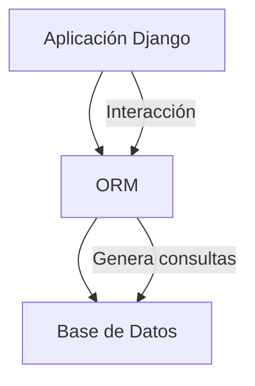
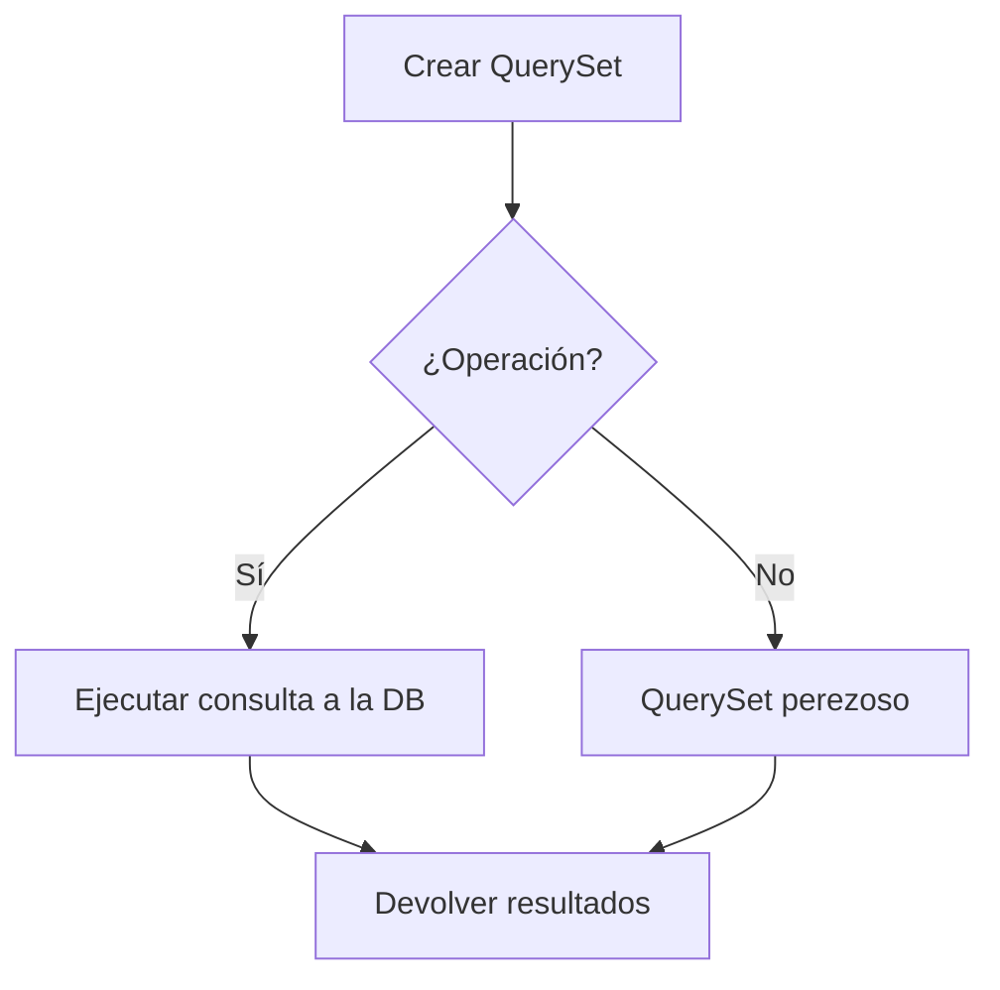

!!! abstract "En resumen"

    El **Shell de Django** es una herramienta esencial durante la etapa de desarrollo y depuración de tus proyectos. Permite acceder directamente al ORM y a los QuerySets para realizar consultas y trabajar con la base de datos.
<!-- more -->

## ¿Qué es Django Shell

El **shell de Django** es una interfaz de línea de comandos interactiva que combina el intérprete de Python con las funcionalidades de Django. Al iniciarlo, carga automáticamente la configuración del proyecto, permitiendo trabajar directamente con sus aplicaciones y modelos.

Una de sus principales ventajas es el acceso al **ORM (Object-Relational Mapper)** de Django, que permite **consultar, crear, modificar y eliminar datos** de la base de datos utilizando Python, sin necesidad de escribir directamente consultas SQL.

Django utiliza **Python** como intérprete interactivo por defecto. Sin embargo, también puedes utilizar [**IPython**](https://ipython.org/){target="_blank" rel="noopener"} o [**bpython**](https://bpython-interpreter.org/){target="_blank" rel="noopener"} como alternativas, siempre que estén instalados en el entorno virtual del proyecto.

## Accediendo al Shell de Django

Para acceder al shell de Django, solo necesitas ejecutar el comando `shell` en un proyecto de Django. Es necesario tener un proyecto de Django configurado y en marcha, si quieres comenzar a configurar un proyecto desde cero, utiliza la herramienta __Generar Nuevo Proyecto__.

--8<-- "includes/generador.html"

Una vez generado el proyecto, tendrás disponible el archivo `manage.py` en el proyecto:

```{ .plaintext .no-copy hl_lines="3" title="Archivos del proyecto" }
 .
├──  venv
├──  manage.py
...
```

Ahora, podemos ejecutar el siguiente comando para ingresar al shell de Django:

```bash title="Terminal"
python manage.py shell
```

Podemos observar como entra en modo interactivo, invitandonos a escribir nuevas instrucciones.

--8<-- "includes/snippets/shell-django-welcome.md"


???+ info
	Para salir del modo interactivo, debes escribir `exit()` o con la combinación de teclas ++ctrl+d++


## **Conceptos de  ORM de Django**

### **¿Qué es Django ORM?**

Django ORM (Object-Relational Mapping) es una potente herramienta que permite interactuar con una base de datos relacional mediante código Python. Con Django ORM, podemos crear, recuperar, actualizar y eliminar registros en la base de datos mediante objetos y métodos Python. 

<div align="center" class="mermaid-container">
<div class="mermaid-title">Funcionamiento de un ORM</div>

</div>


### **¿Qué son los QuerySets?**

Un QuerySet es una colección de objetos de base de datos que se pueden filtrar, ordenar y segmentar para limitar los resultados a un subconjunto específicos. En pocas palabras, un QuerySet es una colección de registros que cumplen con ciertas condiciones definidas en una consulta, pero no necesariamente se ejecuta inmediatamente contra la base de datos hasta que se necesita (esto se llama **lazy evaluation** o evaluación perezosa).

<div align="center" class="mermaid-container">
<div class="mermaid-title">Funcionamiento de los QuerySet</div>

</div>

Antes de profundizar más en el shell de Django y los QuerySets del ORM, debemos crear una aplicación para poder definir un modelo y realizar operaciones en la base de datos.

Asumiendo que ya en este punto, tienes el proyecto generado siguiendo los pasos usando el [generador](#generador), continuamos con la configuración de una aplicación usando el archivo `manage.py`:

```bash title="terminal"
python manage.py startapp fruits
```

Ahora podemos definir un modelo abriendo el archivo `fruits/models.py` y definir el siguiente modelo:

=== "Modelo"
	```py title="fuits/models.py" linenums="1"
	from django.db import models
	
	class FruitsInfo(models.Model):
	
		name = models.CharField(max_length=30)
		origin = models.CharField(max_length=60)
		protein = models.DecimalField(max_digits=4, null=False, decimal_places=2)
		energy = models.IntegerField(default=0)
	
		def __str__(self):
			return self.origin + " " + self.name
	```

=== "Explorador"
	
	```{ .plaintext hl_lines="9" .no-copy }
	 .
	├──  manage.py
	├──  fruits
	│   ├──  __init__.py
	│   ├──  admin.py
	│   ├──  apps.py
	│   ├──  migrations
	│   │   └──  __init__.py
	│   ├──  models.py
	│   ├──  tests.py
	│   └──  views.py
	└──  _site
	```

Luego debemos abrir el archivo `mysite/settings.py` y registrar la app generada:

!!! tree inline end "Explorador"

	```plaintext hl_lines="7"
	 .
	├──  manage.py
	├──  fruits
	└──  _site
    	├──  __init__.py
    	├──  asgi.py
    	├──  settings.py
    	├──  urls.py
    	└──  wsgi.py
	```
```py title="settings.py" hl_lines="8" linenums="33"
INSTALLED_APPS = [
	'django.contrib.admin',
	'django.contrib.auth',
	'django.contrib.contenttypes',
	'django.contrib.sessions',
	'django.contrib.messages',
	'django.contrib.staticfiles',
	'fruits'
]
```

Luego generamos una nueva migración con el comando `makemigrations` y corremos las migraciones pendientes con el comando `migrate`:

=== "Comandos"
	```bash title="Terminal"
	python manage.py makemigrations #(1)!
	python manage.py migrate #(2)!
	```
	
	1. Genera una nueva migración que incluirá al modelo `FruitsInfo` definido anteriormente.
	2. Ejecuta las migraciones pendiente y crea las tablas en la base de datos.

=== "Output"

	```plaintext hl_lines="1 5"
	(venv) ➜ python manage.py makemigrations
	Migrations for 'fruits':
		fruits/migrations/0001_initial.py
			- Create model FruitsInfo
	(venv) ➜ python manage.py makemigrations
	Operations to perform:
		Apply all migrations: admin, auth, contenttypes, fruits, sessions
	Running migrations:
		Applying contenttypes.0001_initial... OK
		Applying auth.0001_initial... OK
		Applying admin.0001_initial... OK
		Applying admin.0002_logentry_remove_auto_add... OK
		Applying admin.0003_logentry_add_action_flag_choices... OK
		Applying contenttypes.0002_remove_content_type_name... OK
		Applying auth.0002_alter_permission_name_max_length... OK
		Applying auth.0003_alter_user_email_max_length... OK
		Applying auth.0004_alter_user_username_opts... OK
		Applying auth.0005_alter_user_last_login_null... OK
		Applying auth.0006_require_contenttypes_0002... OK
		Applying auth.0007_alter_validators_add_error_messages... OK
		Applying auth.0008_alter_user_username_max_length... OK
		Applying auth.0009_alter_user_last_name_max_length... OK
		Applying auth.0010_alter_group_name_max_length... OK
		Applying auth.0011_update_proxy_permissions... OK
		Applying auth.0012_alter_user_first_name_max_length... OK
		Applying fruits.0001_initial... OK
		Applying sessions.0001_initial... OK
	(venv) ➜ django_project
	```


## **Operaciones ORM en el shell**

Ahora para comenzar a realizar operaciones, vamos a ingresar al shell como lo vimos anteriormente:

```bash title="terminal"
python manage.py shell
```

### **Insertar :octicons-diff-added-16:**

En Django, una clase modelo representa una tabla de base de datos y una instancia de esa clase representa un registro particular dentro de la base de datos. Esto es análogo a usar una sentencia [`INSERT` en SQL](https://en.wikipedia.org/wiki/Insert_(SQL)).


#### Método `save()`

Se puede crear un registro simplemente instanciando la clase definida en el modelo usando los argumentos de palabras claves, luego debemos llamar al método `save()` y así confirmar el nuevo registro en la base de datos.

En el siguiente ejemplo, veremos que sencillo es agregar un nuevo registro a la clase del modelo:

=== ":octicons-code-16: python"

	```py  hl_lines="3"
	from fruits.models import FruitsInfo #(1)!
	record = FruitsInfo(name="banana", origin="USA", protein=1.09, energy=371) #(2)!
	record.save() # (3)!
	```

	1. Importamos la clase del modelo
	2. Instanciamos la clase y la almacenamos en una variable
	3. invocamos al método `save()` para insertar en la base de datos

=== ":octicons-terminal-16: shell python"

	```plaintext
	(InteractiveConsole)
	>>> from fruits.models import FruitsInfo
	>>> record = record = FruitsInfo(name="banana", origin="USA", protein=1.09, energy=371)
	>>> record.save()
	```

=== ":octicons-terminal-16: shell ipython"
	
	```plaintext
	In [1]: from fruits.models import FruitsInfo
	In [2]: record = FruitsInfo(name="banana", origin="USA", protein=1.09, energy=371)
	In [3]: record.save()
	```


!!! info "Nota"
	Si no recibimos mensajes de errores indicados en la consola de Django, podemos suponer que el registro se agregó correctamente

#### Método `create()`

Otra forma de insertar un registro en una clase modelo es usar el método `create()`. Esto elimina la necesidad de llamar al método `save()` para confirmar el registro en la base de datos. El siguiente ejemplo muestra su uso:

=== ":octicons-code-16: python"

	```py hl_lines="2"
	from fruits.models import FruitsInfo
	FruitsInfo.objects.create(name="apple", origin="USA", protein=0.26, energy=218)
	```
=== ":octicons-terminal-16: shell python"

	```plaintext
	(InteractiveConsole)
	>>> from fruits.models import FruitsInfo
	>>> FruitsInfo.objects.create(name="apple", origin="USA", protein=0.26, energy=218)
	>>> <FruitsInfo: USA apple>
	```
=== ":octicons-terminal-16: shell ipython"

	```plaintext
	In [1]: from fruits.models import FruitsInfo
	In [2]: FruitsInfo(name="banana", origin="USA", protein=1.09, energy=371)
	Out[2]: <FruitsInfo: USA apple>
	```

???+ info
	Si observamos el resultado en el shell, el método `create()` nos retorna un **QuerySet** con el objeto que acabamos de insertar.

### **Insertar múltiples registros**

Ahora veremos cómo insertar varios registros en una clase específica. Creamos una nueva clase `FruitsVendor` dentro de :octicons-file-code-16: `models.py` en la aplicación:

=== "Modelo"

	```py title="fruits/models.py"
	class FruitsVendors(models.Model):

		vendor_id = models.CharField(max_length=4, null=False, primary_key=True)
		vendor_name = models.CharField(max_length=60)
		vendor_location = models.CharField(max_length=40)

		def __str__(self):
			return f"{self.vendor_id} - {self.vendor_name} - {self.vendor_location}"
	```
=== "Explorador"
	
	```{ .plaintext hl_lines="9" .no-copy }
	 .
	├──  manage.py
	├──  fruits
	│   ├──  __init__.py
	│   ├──  admin.py
	│   ├──  apps.py
	│   ├──  migrations
	│   │   └──  __init__.py
	│   ├──  models.py
	│   ├──  tests.py
	│   └──  views.py
	└──  _site
	```

En la nueva clase `FruitsVendors`, hemos definido un campo con llave primaria llamado `vendor_id`. Luego, definimos el método `__str__()` para mostrar todos los datos dentro de la clase en una cadena con formato.

Generamos una nueva migración y las ejecutamos con el comando `migrate`:

=== "bash"

	```bash
	python manage.py makemigrations
	python manage.py migrate
	```

=== "output"

	```plaintext
	Migrations for 'fruits':
  	fruits/migrations/0002_fruitsvendor.py
    	- Create model FruitsVendor
	Operations to perform:
  	Apply all migrations: admin, auth, contenttypes, fruits, sessions
	Running migrations:
  	Applying fruits.0002_fruitsvendor... OK
	```

#### Método `bulk_create()`

Ahora podemos volver al shell e insertar múltiples registros en la clase `FluitsVendors` a la vez usando el método `bulk_create()`. El siguiente ejemplo muestra su uso:

=== ":octicons-code-16: python"

	```py
	from fruits.models import FruitsVendors
	FruitsVendors.objects.bulk_create(
		[
			FruitsVendors(vendor_id="V001", vendor_name="Fresh Fruits", vendor_location = "New York"),
			FruitsVendors(vendor_id="V002", vendor_name="Direct Delivery", vendor_location = "Sao Paulo"),
			FruitsVendors(vendor_id="V003", vendor_name="Fruit Mate", vendor_location = "Sydney")
		]
	)
	```

=== ":octicons-terminal-16: shell python"

	```plaintext
	(InteractiveConsole)
	>>> from fruits.models import FruitsVendors
	>>> FruitsVendors.objects.bulk_create(
	...     [
	...         FruitsVendors(vendor_id="V001", vendor_name="Fresh Fruits", vendor_location = "New York"),
	...         FruitsVendors(vendor_id="V002", vendor_name="Direct Delivery", vendor_location = "Sao Paulo"),
	...         FruitsVendors(vendor_id="V003", vendor_name="Fruit Mate", vendor_location = "Sydney")
	...     ]
	... )
	[<FruitsVendors: FruitsVendors object (V001)>,
	 <FruitsVendors: FruitsVendors object (V002)>,
	 <FruitsVendors: FruitsVendors object (V003)>]
	```

=== ":octicons-terminal-16: shell ipython"

	```ipython
	In [1]: from fruits.models import FruitsVendors
	   ...: FruitsVendors.objects.bulk_create(
	   ...:     [
	   ...:         FruitsVendors(vendor_id="V001", vendor_name="Fresh Fruits", vendor_location = "New York"),
	   ...:         FruitsVendors(vendor_id="V002", vendor_name="Direct Delivery", vendor_location = "Sao Paulo"),
	   ...:         FruitsVendors(vendor_id="V003", vendor_name="Fruit Mate", vendor_location="Sydney")
	   ...:     ]
	   ...: )
	Out[1]:
	[<FruitsVendors: FruitsVendors object (V001)>,
	 <FruitsVendors: FruitsVendors object (V002)>,
	 <FruitsVendors: FruitsVendors object (V003)>]
	```

Ahora que ya hemos guardado objetos en la base de datos, vamos a continuar con la operación de obtener esos registros.

### **Listar :octicons-list-unordered-16:**

#### Método `all()`

Verificaremos esto utilizando el método `all()` que nos retorna un QuerySet que describe todos los objetos de la tabla en la base de datos:

=== ":octicons-code-16: python"

	```py hl_lines="2"
	from fruits.models import FruitsVendors
	FruitsVendors.objects.all()
	```
=== ":octicons-terminal-16: shell python"

	```bpython
	(InteractiveConsole)
	>>> from fruits.models import FruitsVendors
	>>> FruitsVendors.objects.all()
	<QuerySet [<FruitsVendors: V001 - Fresh Fruits - New York>, <FruitsVendors: V002 - Direct Delivery - Sao Paulo>, <FruitsVendors: V003 - Fruit Mate - Sydney>]>
	```

=== ":octicons-terminal-16: shell ipython"

	```ipython
	In [1]: from fruits.models import FruitsVendors
	In [2]: FruitsVendors.objects.all()
	Out[2]: <QuerySet [<FruitsVendors: V001 - Fresh Fruits - New York>, <FruitsVendors: V002 - Direct Delivery - Sao Paulo>, <FruitsVendors: V003 - Fruit Mate - Sydney>]>
	```

Debido a que hemos definido un método `__str__()` para mostrar un objeto en un formato legible para nosotros los humanos 😎, el método `all()` mostrará solo el valor definido en el método `__str__()`.

El método `values()` permite extraer los valores de un objeto determinado como se muestra a continuación:

=== ":octicons-code-16: python"

	```py
	FruitsVendors.objects.all().values()
	```
=== ":octicons-terminal-16: shell python"

	```plaintext
	(InteractiveConsole)
	>>> FruitsVendors.objects.all(),values()
	<QuerySet [{'vendor_id': 'V001', 'vendor_name': 'Fresh Fruits', 'vendor_location': 'New York'}, {'vendor_id': 'V002', 'vendor_name': 'Direct Delivery', 'vendor_location': 'Sao Paulo'}, {'vendor_id': 'V003', 'vendor_name': 'Fruit Mate', 'vendor_location': 'Sydney'}]>
	```

=== ":octicons-terminal-16: shell ipython"

	```ipython
	In [2]: FruitsVendors.objects.all().values()
	Out[2]: <QuerySet [{'vendor_id': 'V001', 'vendor_name': 'Fresh Fruits', 'vendor_location': 'New York'}, {'vendor_id': 'V002', 'vendor_name': 'Direct Delivery', 'vendor_location': 'Sao Paulo'}, {'vendor_id': 'V003', 'vendor_name': 'Fruit Mate', 'vendor_location': 'Sydney'}]>
	```

#### Método `get()`

Si quisieramos recuperar un solo registro, podemos usar el método `get()`. Sin embargo, si hay más de un registro que coincida con la consulta que especificamos dentro del método `get()`, esto dará como resultado un error `MultipleObjectsReturned`.

El método `get()` es más viable cuando buscamos utilizando campos con índices únicos, como llave primaria. El siguiente ejemplo muestra el método `get()` utilizando el campo **id**:

=== ":octicons-code-16: python"

	```python
	from fruits.models import FruitsInfo
	FruitsInfo.objects.get(id=2)
	```
=== ":octicons-terminal-16: shell python"

	```bpython
	>>> from fruits.models import FruitsInfo
	>>> FruitsInfo.objects.get(id=2)
	<FruitsInfo: USA apple>
	```

=== ":octicons-terminal-16: shell ipython"

	```ipython
	In [1]: from fruits.models import FruitsInfo
   	In [2]: FruitsInfo.objects.get(id=2)
	Out[2]: <FruitsInfo: USA apple>
	```

### **Búsquedas :octicons-search-16:**

En el ORM de Django, podemos especificar operadores para filtrar un conjunto. Esto es análogo a los operadores que se pueden especificar dentro de una declaración [`WHERE` de SQL](https://es.wikipedia.org/wiki/SQL#:~:text=Cl%C3%A1usula%20WHERE%20(Donde)). Algunos ejemplos de búsquedas de campos y sus operadores SQL correspondientes son:

|ORM|SQL|
|:--|:--|
|`contains`|`LIKE`|
|`range`|`BETWEEN`|
|`gte` (mayor o igual que)|`>=`|
|`lte` (menor o igual que)|`<=`|

Los siguientes ejemplos demuestran cómo podemos utilizar las búsquedas por atributos dentro de Django shell.

#### Operador - `contains`

Busquemos nombres de proveedores que incluyan la palabra "Fruits" en la clase `FruitsVendor`:

=== ":octicons-code-16: python"

	```python
	from fruits.models import FruitsVendors
	FruitsVendors.objects.filter(vendor_name__contains="Fruit")
	```

=== ":octicons-terminal-16: shell python"

	```plaintext
	>>> from fruits.models import FruitsVendors
	>>> FruitsVendors.objects.filter(vendor_name__contains="Fruit")
	<QuerySet [<FruitsVendor: FruitsVendor object (V001)>, <FruitsVendor: FruitsVendor object (V003)>]
	```

=== ":octicons-terminal-16: shell ipython"

	```ipython
	In [1]: from fruits.models import FruitsVendors
	In [2]: FruitsVendors.objects.filter(vendor_name__contains="Fruit")
	Out[2]: <QuerySet [<FruitsVendors: V001 - Fresh Fruits - New York>, <FruitsVendors: V003 - Fruit Mate - Sydney>]>
	```

#### Operador - `gte` y `lte`

En los siguientes ejemplos, buscaremos registros usando los operadores de mayor y menor que:

=== ":octicons-code-16: python"
	```py
	from fruits.models import FruitsInfo
	FruitsInfo.objects.filter(protein__gte=1)
	FruitsInfo.objects.filter(energy__lte=250)
	```
=== ":octicons-terminal-16: shell python"
	```
	>>> from fruits.models import FruitsInfo
	>>> FruitsInfo.objects.filter(protein__gte=1)
	<QuerySet [<FruitsInfo: USA banana>]>
	>>> FruitsInfo.objects.filter(energy__lte=250)
	<QuerySet [<FruitsInfo: USA apple>]>
	```
=== ":octicons-terminal-16: shell ipython"
	```
	In [1]: from fruits.models import FruitsInfo
	In [2]: FruitsInfo.objects.filter(protein__gte=1)
	Out[2]: <QuerySet [<FruitsInfo: USA banana>]>
	In [3]: FruitsInfo.objects.filter(energy__lte=250)
	Out[3]: <QuerySet [<FruitsInfo: USA apple>]>
	```
#### Operador - `range`

En los siguientes ejemplos, buscaremos registros usando los operadores de range:

=== ":octicons-code-16: python"
	```py
	from fruits.models import FruitsInfo
	FruitsInfo.objects.filter(energy__range=(200, 300))
	FruitsInfo.objects.filter(energy__range=(200, 400))
	```
=== ":octicons-terminal-16: shell python"
	```
	>>> from fruits.models import FruitsInfo
	>>> FruitsInfo.objects.filter(energy__range=(200, 300))
	<QuerySet [<FruitsInfo: USA apple>]>
	>>> FruitsInfo.objects.filter(energy__range=(200, 400))
	<QuerySet [<FruitsInfo: USA banana>, <FruitsInfo: USA apple>]>
	```
=== ":octicons-terminal-16: shell ipython"
	```
	In [1]: from fruits.models import FruitsInfo
	In [2]: FruitsInfo.objects.filter(energy__range=(200, 300))
	Out[2]: <QuerySet [<FruitsInfo: USA apple>]>
	In [3]: FruitsInfo.objects.filter(energy__range=(200, 400))
	Out[3]: <QuerySet [<FruitsInfo: USA banana>, <FruitsInfo: USA apple>]>
	```

### **Actualizar :octicons-sync-16:**

La operación de actualización se puede realizar junto con el método `filter()` para especificar el registro que se puede actualizar. Actualicemos el atributo `origin` al registro (`id=1`) en la tabla `FruitsInfo`:

=== ":octicons-code-16: python"
	```python hl_lines="3"
	from fruits.models import FruitsInfo
	FruitsInfo.objects.get(id=1).origin #(1)!
	FruitsInfo.objects.filter(id=1).update(origin='australia') #(2)!
	FruitsInfo.objects.get(id=1).origin #(3)!
	```

	1. Mostramos el valor actual del atributo origin
	2. Actualizamos el atributo origin
	3. Mostramos el valor actualizado del atributo origin

=== ":octicons-terminal-16: shell python"

	```bpython
	>>> from fruits.models import FruitsInfo
	>>> FruitsInfo.objects.get(id=1).origin
	'USA'
	>>> FruitsInfo.objects.filter(id=1).update(origin='australia')
	1
	>>> FruitsInfo.objects.get(id=1).origin
	'australia'
	```

=== ":octicons-terminal-16: shell ipython"

	```bpython
	In [1]: from fruits.models import FruitsInfo
	In [2]: FruitsInfo.objects.get(id=1).origin
	Out[2]: 'USA'
	In [3]: FruitsInfo.objects.filter(id=1).update(origin='australia')
	Out[3]: 1
	In [4]: FruitsInfo.objects.get(id=1).origin
	Out[4]: 'australia'
	```

### **Eliminar :octicons-x-circle-16:**

El ORM nos ofrece el método `delete()` para eliminar registros de una clase específica. Esto es análogo a la instrucción [`DELETE` en SQL](https://en.wikipedia.org/wiki/Delete_(SQL))

#### Eliminar un registro - Método `delete()`

Al eliminar un solo registro, debemos utilizar el método `get()`, ya que devuelve directamente el objeto especificado. En el siguiente ejemplo eliminamos un registro (`id=3`) de la clase `FruitsInfo()`:

=== "Python"
	```python
	from fruits.models import FruitsInfo
	
	FruitsInfo.objects.all() #(1)!
	FruitsInfo.objects.get(id=3).delete() #(2)!
	FruitsInfo.objects.all() #(3)!
	```

	1. Mostramos todos los objetos
	2. Eliminamos el objeto
	3. Mostramos todos los objetos nuevamente

=== "Shell"

	```
	>>> from fruits.models import FruitsInfo
	>>> FruitsInfo.objects.all().values()
	<QuerySet [<FruitsInfo: australia apple>, <FruitsInfo: USA banana>, <FruitsInfo: USA pineapple>]>
	>>> FruitsInfo.objects.get(id=3).delete()
	(1, {'fruits.FruitsInfo': 1})
	>>> FruitsInfo.objects.all()
	<QuerySet [<FruitsInfo: australia apple>, <FruitsInfo: USA banana>]>
	```

#### Eliminar varios registros - Método `delete()`

El método `delete()` se puede utilizar para eliminar todos los registros de una clase determinada, simplemente especificando la operación de eliminación con el método `all()` para eliminar todos o `filter()` para eliminar un conjunto que cumpla una determinada condición. En el siguiente ejemplo, eliminaremos todos los registros:

=== "Python"
	```python
	from fruits.models import FruitsInfo
	
	FruitsInfo.objects.all() #(1)!
	FruitsInfo.objects.all().delete() #(2)!
	FruitsInfo.objects.all() #(3)!
	```

	1. Mostramos todos los objetos
	2. Eliminamos todos los objetos
	3. Comprobamos, mostrando todos los objetos

=== "Shell"

	```
	>>> from fruits.models import FruitsInfo
	>>> FruitsInfo.objects.all()
	<QuerySet [<FruitsInfo: australia apple>, <FruitsInfo: USA banana>]>
	>>> FruitsInfo.objects.all().delete()
	(2, {'fruits.FruitsInfo': 2})
	>>> FruitsInfo.objects.all()
	<QuerySet []>
	```
