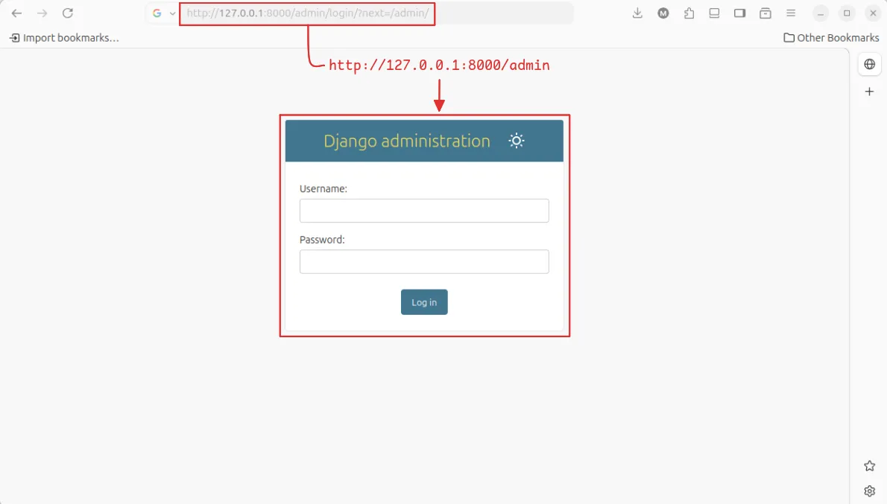
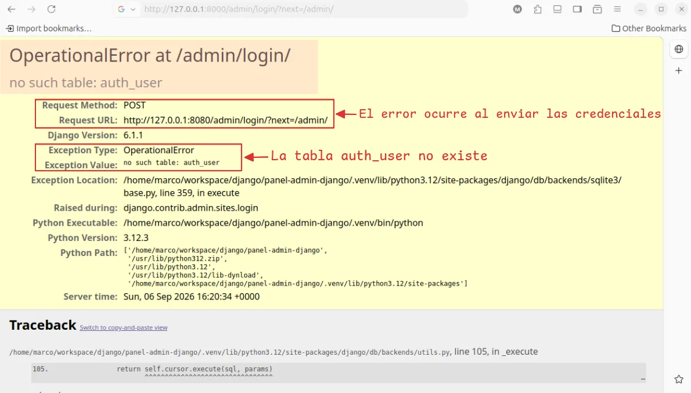

!!! abstract "En resumen"

    La **aplicación de administración de Django** permite crear un área de administración para gestionar los modelos del proyecto de forma sencilla, reduciendo el tiempo y esfuerzo necesarios para desarrollar estas funcionalidades manualmente.
<!-- more -->

## Instrucciones: nuevo proyecto {#instrucciones}

--8<-- "snippets/nuevo-proyecto.md"

## Habilitar el panel administrativo

Django incluye su propia aplicación de administración, por lo que no es necesario instalar ningún paquete adicional para utilizarla. Toda la configuración requerida para incluir la aplicación de administración de Django fue hecha automáticamente cuando [creaste el esqueleto del proyecto](#instrucciones){ data-preview }.

Podemos comprobarlo dentro del archivo :octicons-file-code-16: `settings.py`, donde aparece dentro de `INSTALLED_APPS`:

<div class="grid first-grid cards" markdown>

```py title="_site/settings.py" hl_lines="2" linenums="33"
INSTALLED_APPS = [
    'django.contrib.admin',
    'django.contrib.auth',
    'django.contrib.contenttypes',
    'django.contrib.sessions',
    'django.contrib.messages',
    'django.contrib.staticfiles'
]
```

```{ .plaintext .no-copy hl_lines="5" title="Abrir el archivo settings" }
 ...
└──  _site
    ├──  __init__.py
    ├──  asgi.py
    ├──  settings.py
    ├──  urls.py
    └──  wsgi.py
```

</div>

La aplicación de administración también incluye su propia ruta de acceso, la cual Django incorpora automáticamente al crear un nuevo proyecto. Esta configuración puede comprobarse en el archivo `urls.py` principal del proyecto:

<div class="grid first-grid cards" markdown>

```python title="_site/url.py" linenums="17" hl_lines="5"
from django.contrib import admin
from django.urls import path

urlpatterns = [
    path("admin/", admin.site.urls),
]
```

```{ .plaintext .no-copy hl_lines="6" title="Abrir el archivo urls principal" }
 ...
└──  _site
    ├──  __init__.py
    ├──  asgi.py
    ├──  settings.py
    ├──  urls.py
    └──  wsgi.py
```

</div>

La línea `path("admin/", admin.site.urls)` conecta la ruta `/admin/` con la interfaz de administración de Django. Por lo tanto, una vez iniciado el servidor de desarrollo, podemos acceder al panel desde `http://127.0.0.1:8000/admin/`.



De esta manera, tanto la aplicación administrativa como su ruta de acceso ya se encuentran configuradas desde la creación del proyecto.

En este punto, si intentas introducir credenciales, Django mostrará el error de `no such table: auth_user`:



## Ejecutar las migraciones

El error anterior indica que la tabla `auth_user`, utilizada por Django para almacenar los usuarios, todavía no existe en la base de datos. Para crear esta y las demás tablas necesarias del proyecto, debemos ejecutar las migraciones pendientes:

--8<-- "snippets/examples/migrate/initial-migrate-project.md"

## Crear un superusuario

--8<-- "snippets/examples/admin/create-superuser.md"
