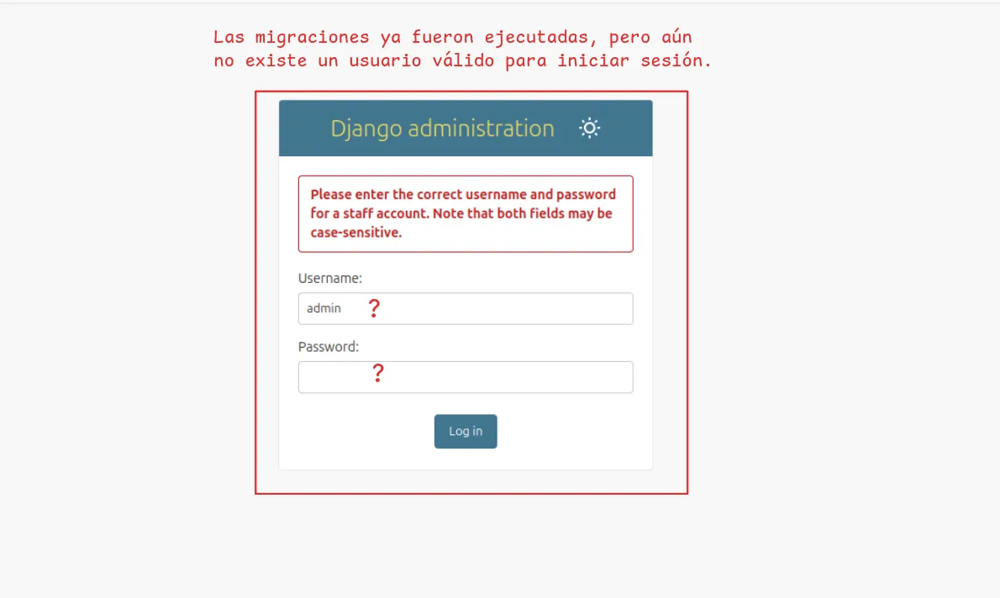
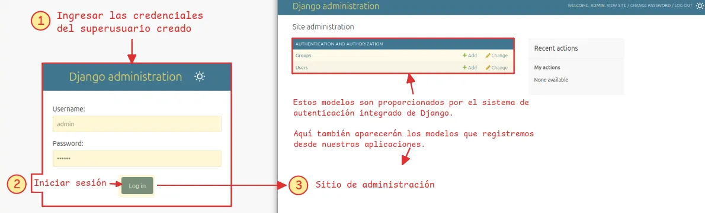
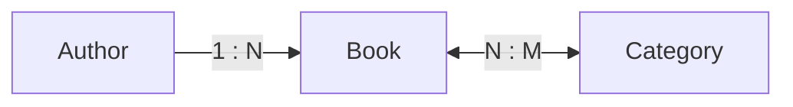
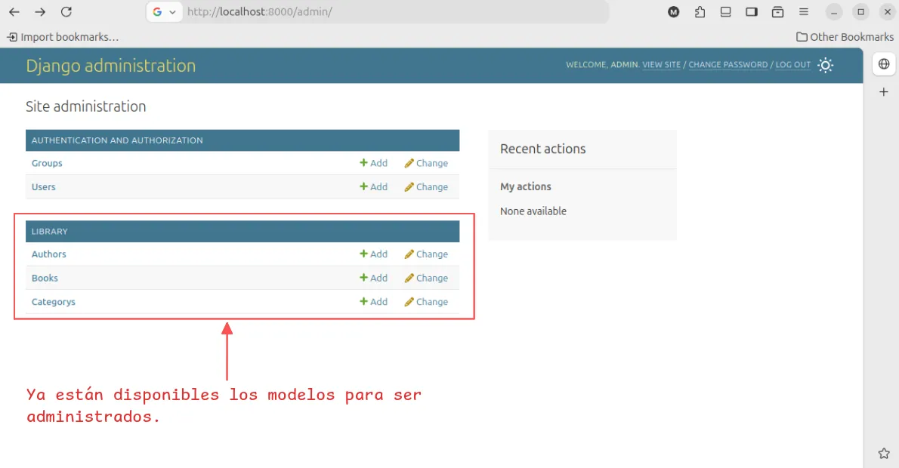
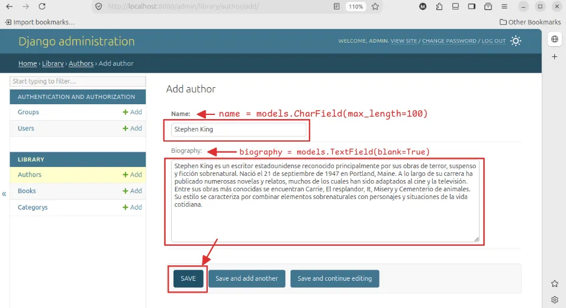
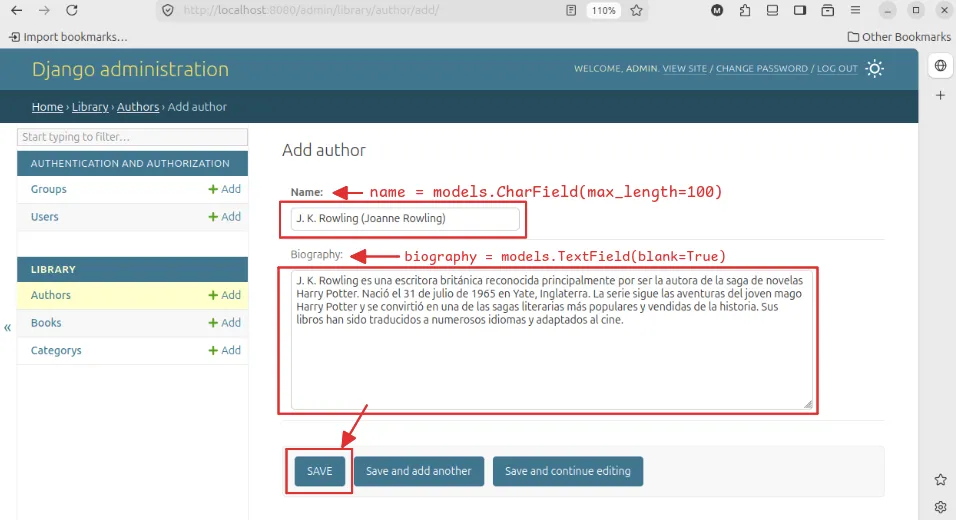
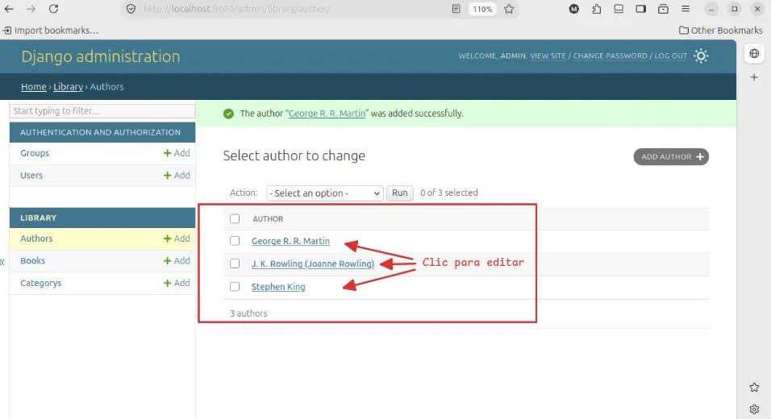
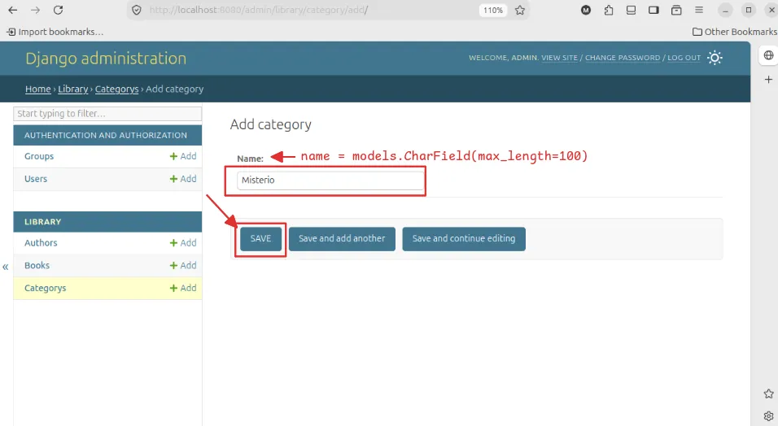
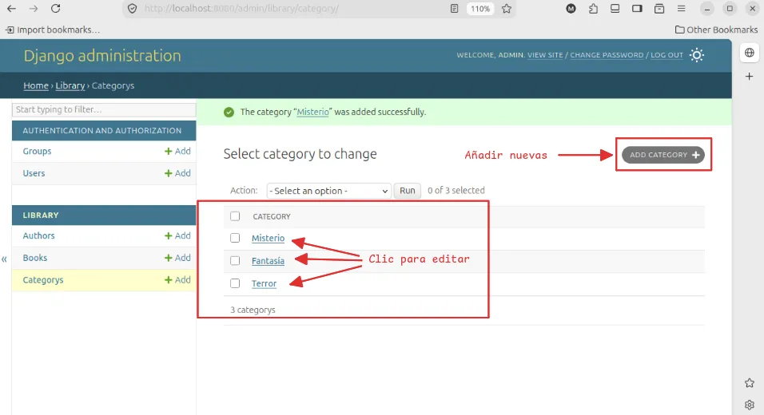
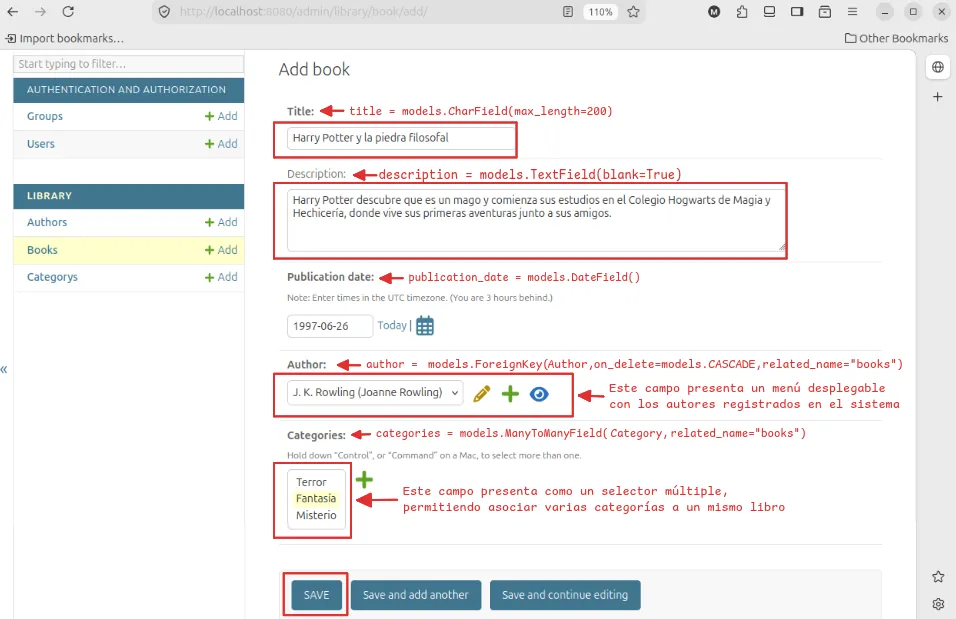

!!! abstract "En resumen"

    La **aplicación de administración de Django** permite crear un área de administración para gestionar los modelos del proyecto de forma sencilla, reduciendo el tiempo y esfuerzo necesarios para desarrollar estas funcionalidades manualmente.
<!-- more -->

## Instrucciones: nuevo proyecto

--8<-- "snippets/nuevo-proyecto.md"

## Habilitar el panel administrativo

Django incluye su propia aplicación de administración, por lo que no es necesario instalar ningún paquete adicional para utilizarla. Toda la configuración requerida para incluir la aplicación de administración de Django fue hecha automáticamente cuando [creaste el esqueleto del proyecto](#instrucciones-nuevo-proyecto){ data-preview }.

Podemos comprobarlo dentro del archivo :octicons-file-code-16: `settings.py`, donde aparece dentro de `INSTALLED_APPS`:

<div class="grid first-grid cards" markdown>

```py title="_site/settings.py" hl_lines="2" linenums="33"
INSTALLED_APPS = [
    'django.contrib.admin',
    'django.contrib.auth',
    'django.contrib.contenttypes',
    'django.contrib.sessions',
    'django.contrib.messages',
    'django.contrib.staticfiles'
]
```

```{ .plaintext .no-copy hl_lines="5" title="Abrir el archivo settings" }
 ...
└──  _site
    ├──  __init__.py
    ├──  asgi.py
    ├──  settings.py
    ├──  urls.py
    └──  wsgi.py
```

</div>

La aplicación de administración también incluye su propia ruta de acceso, la cual Django incorpora automáticamente al crear un nuevo proyecto. Esta configuración puede comprobarse en el archivo `urls.py` principal del proyecto:

<div class="grid first-grid cards" markdown>

```python title="_site/url.py" linenums="17" hl_lines="5"
from django.contrib import admin
from django.urls import path

urlpatterns = [
    path("admin/", admin.site.urls),
]
```

```{ .plaintext .no-copy hl_lines="6" title="Abrir el archivo urls principal" }
 ...
└──  _site
    ├──  __init__.py
    ├──  asgi.py
    ├──  settings.py
    ├──  urls.py
    └──  wsgi.py
```

</div>

La línea `path("admin/", admin.site.urls)` conecta la ruta `/admin/` con la interfaz de administración de Django. Por lo tanto, una vez iniciado el servidor de desarrollo, podemos acceder al panel desde `http://127.0.0.1:8000/admin/`.


De esta manera, tanto la aplicación administrativa como su ruta de acceso ya se encuentran configuradas desde la creación del proyecto.

En este punto, si intentas introducir credenciales, Django mostrará el error de `no such table: auth_user`:


## Ejecutar las migraciones

El error anterior indica que la tabla `auth_user`, utilizada por Django para almacenar los usuarios, todavía no existe en la base de datos. Para crear esta y las demás tablas necesarias del proyecto, debemos ejecutar las migraciones pendientes:

--8<-- "snippets/examples/migrate/initial-migrate-project.md"

Las tablas ya fueron creadas, pero todavía no existe ningún usuario registrado.



## Crear un superusuario

--8<-- "snippets/examples/admin/create-superuser.md"

Una vez que hayas completado el comando con la información requerida, se agregará un nuevo administrador a la base de datos. Ahora, reinicia el servidor de desarrollo para probar el inicio de sesión:

--8<-- "snippets/examples/admin/run-server-after-migrate.md"

## Iniciar sesión y usar el sitio

Con las migraciones ejecutadas y el superusuario creado, ya podemos iniciar sesión en el panel de administración de Django. Para ello, accede nuevamente a `http://127.0.0.1:8000/admin` e ingresa las credenciales del superusuario.

Una vez iniciada la sesión, veremos los modelos **Usuarios** y **Grupos**, proporcionados por el sistema de autenticación integrado de Django.



A continuación, crearemos nuestra propia aplicación para definir y registrar los modelos que utilizará nuestro proyecto, permitiéndonos gestionarlos directamente desde este mismo panel de administración.

## Registrar modelos el administrador

En este ejemplo crearemos una aplicación llamada `library` para gestionar una pequeña biblioteca desde el panel de administración. La aplicación tendrá distintos modelos, como `Author`, `Category` y `Book`, que estarán relacionados entre sí.

### 1. Crear la aplicación

Desde la carpeta donde se encuentra `manage.py`, ejecutamos el siguiente comando:

=== "Comando"

    ```bash
    (.venv) python manage.py startapp library
    ```

Esto creará la estructura básica de la aplicación:

<div class="grid cards" markdown>

```{ .bash .no-copy hl_lines="8 10" title="Archivos de la aplicación" }
 ...
├──  manage.py
├──  _site
└──  library
    ├──  migrations
    │   └──  __init__.py
    ├──  __init__.py
    ├──  admin.py
    ├──  apps.py
    ├──  models.py
    ├──  tests.py
    └──  views.py
```

- **Archivos principales**

    ---

    :octicons-file-code-16: **`models.py`**

      Aquí definiremos los modelos de nuestra aplicación.

    :octicons-file-code-16: **`admin.py`**

      Aquí registraremos los modelos para poder gestionarlos desde el administrador de Django.

</div>

### 2. Registrar la aplicación

Para que Django reconozca la nueva aplicación y sus modelos, debemos agregarla a `INSTALLED_APPS` en `settings.py`. De esta forma, Django podrá tenerlos en cuenta al momento de crear y aplicar las migraciones.

<div class="grid first-grid cards" markdown>

```py title="_site/settings.py" hl_lines="8" linenums="33"
INSTALLED_APPS = [
    'django.contrib.admin',
    'django.contrib.auth',
    'django.contrib.contenttypes',
    'django.contrib.sessions',
    'django.contrib.messages',
    'django.contrib.staticfiles',
    'library'
]
```

```{ .plaintext .no-copy hl_lines="5" title="Abrir el archivo settings" }
 ...
└──  _site
    ├──  __init__.py
    ├──  asgi.py
    ├──  settings.py
    ├──  urls.py
    └──  wsgi.py
```

</div>

### 3. Crear los modelos

Ahora definiremos los modelos que utilizará nuestra biblioteca.

Abrimos el modelo `library/models.py` y agregamos lo siguiente:

<div class="grid first-grid cards" markdown>

```{ .python linenums="1" title="models.py" }
from django.db import models


class Author(models.Model):
    name = models.CharField(max_length=100)
    biography = models.TextField(blank=True)

    def __str__(self):
        return self.name


class Category(models.Model):
    name = models.CharField(max_length=100)

    def __str__(self):
        return self.name


class Book(models.Model):
    title = models.CharField(max_length=200)
    description = models.TextField(blank=True)
    publication_date = models.DateField()
    author = models.ForeignKey(
        Author,
        on_delete=models.CASCADE,
        related_name="books",
    )
    categories = models.ManyToManyField(
        Category,
        related_name="books"
    )

    def __str__(self):
        return self.title
```

```{ .bash .no-copy hl_lines="10" title="Archivos de la aplicación" }
 ...
├──  manage.py
├──  _site
└──  library
    ├──  migrations
    │   └──  __init__.py
    ├──  __init__.py
    ├──  admin.py
    ├──  apps.py
    ├──  models.py
    ├──  tests.py
    └──  views.py
```

</div>

En este caso tenemos tres modelos:

- `Author`: almacena la información de los autores.
- `Category`: almacena las categorías de los libros.
- `Book`: almacena los libros y se relaciona con autores y categorías.



El modelo `Book` utiliza una relación `ForeignKey` para asociar cada libro con un autor y una relación `ManyToManyField` para permitir que un libro tenga varias categorías y que una categoría contenga varios libros.

### 4. Crear las migraciones

Una vez definidos los modelos, debemos indicarle a Django que genere las migraciones correspondientes:

=== "Comando"

    ```bash
    (.venv) python manage.py makemigrations
    ```

=== "Output"

    ```{ .bash .no-copy }
    Migrations for 'library':
    library/migrations/0001_initial.py
        + Create model Author
        + Create model Category
        + Create model Book
    ```

Django detectará los nuevos modelos y creará una migración en `library/migrations` con el nombre de `0001_initial.py`. Este archivo es el que utiliza el ORM para posteriormente crear las tablas en la base de datos cuando se aplica la migración. El archivo generado se ve de la siguiente manera:

```{ .py .no-copy .mh-5 title="migrations/0001_initial.py" }
# Generated by Django 6.1.1 on 2026-09-08 08:22

import django.db.models.deletion
from django.db import migrations, models


class Migration(migrations.Migration):

    initial = True

    dependencies = [
    ]

    operations = [
        migrations.CreateModel(
            name='Author',
            fields=[
                ('id', models.BigAutoField(auto_created=True, primary_key=True, serialize=False, verbose_name='ID')),
                ('name', models.CharField(max_length=100)),
                ('biography', models.TextField(blank=True)),
            ],
        ),
        migrations.CreateModel(
            name='Category',
            fields=[
                ('id', models.BigAutoField(auto_created=True, primary_key=True, serialize=False, verbose_name='ID')),
                ('name', models.CharField(max_length=100)),
            ],
        ),
        migrations.CreateModel(
            name='Book',
            fields=[
                ('id', models.BigAutoField(auto_created=True, primary_key=True, serialize=False, verbose_name='ID')),
                ('title', models.CharField(max_length=200)),
                ('description', models.TextField(blank=True)),
                ('publication_date', models.DateField()),
                ('author', models.ForeignKey(on_delete=django.db.models.deletion.CASCADE, related_name='books', to='library.author')),
                ('categories', models.ManyToManyField(related_name='books', to='library.category')),
            ],
        ),
    ]
```

### 5. Aplicar las migraciones

Ahora aplicamos las migraciones a la base de datos:

=== "Comando"

    ```bash
    python manage.py migrate
    ```
=== "Output"

    ```{ .bash .no-copy }
    Operations to perform:
    Apply all migrations: admin, auth, contenttypes, library, sessions
    Running migrations:
    Applying library.0001_initial... OK
    ```

Con esto, Django creará las tablas necesarias para `Author`, `Category` y `Book`, además de las tablas utilizadas para gestionar sus relaciones.

!!! success "Ver las tablas en la base de datos"

    Podemos abrir la base de datos utilizando una herramienta como [**SQLite CLI**](https://sqlite.org/cli.html){:target="_blank"} y comprobar que las tablas de nuestros modelos se crearon correctamente.

    ```{ .bash .no-copy hl_lines="1 5" title="Terminal" }
    (.venv) ➜ sqlite3 db.sqlite3
    -- Loading resources from /home/marco/.sqliterc
    SQLite version 3.45.1 2024-01-30 16:01:20
    Enter ".help" for usage hints.
    sqlite> .tables
    auth_group                  django_content_type
    auth_group_permissions      django_migrations
    auth_permission             django_session
    auth_user                   library_author
    auth_user_groups            library_book
    auth_user_user_permissions  library_book_categories
    django_admin_log            library_category
    sqlite>
    ```

### 6. Registrar los modelos en el administrador

Para administrar estos modelos desde Django Admin, debemos registrarlos en `library/admin.py`:

<div class="grid first-grid cards" markdown>

```python title="library/admin.py" hl_lines="4-6" linenums="1"
from django.contrib import admin
from .models import Author, Book, Category

admin.site.register(Author)
admin.site.register(Category)
admin.site.register(Book)
```

```{ .bash .no-copy hl_lines="9" title="Archivos de la aplicación" }
 ...
├──  manage.py
├──  _site
└──  library
    ├──  migrations
    │   └──  __init__.py
    │   └──  0001_initial.py
    ├──  __init__.py
    ├──  admin.py
    ├──  apps.py
    ├──  models.py
    ├──  tests.py
    └──  views.py
```

</div>

También podemos utilizar `@admin.register()` para registrar cada modelo:

```python title="library/admin.py" linenums="1" hl_lines="5-7 9-11 13-15"
from django.contrib import admin
from .models import Author, Book, Category


@admin.register(Author)
class AuthorAdmin(admin.ModelAdmin):
    list_display = ("name",)

@admin.register(Category)
class CategoryAdmin(admin.ModelAdmin):
    list_display = ("name",)

@admin.register(Book)
class BookAdmin(admin.ModelAdmin):
    list_display = ("title", "author", "publication_date")
```

Esta segunda alternativa permite personalizar la forma en que cada modelo se muestra dentro del administrador.

### 7. Acceder al administrador

Iniciamos el servidor:

=== "Comando"

    ```bash
    (.venv) python manage.py runserver
    ```

=== "Output"

    ```{ .bash hl_lines="1 8" }
    (.venv) ➜ python manage.py runserver
    Watching for file changes with StatReloader
    Performing system checks...

    System check identified no issues (0 silenced).
    September 10, 2026 - 00:15:04
    Django version 6.1.1, using settings '_site.settings'
    Starting WSGI development server at http://127.0.0.1:8000/
    Quit the server with CONTROL-C.

    WARNING: This is a development server. Do not use it in a production setting. Use a production WSGI or ASGI server instead.
    For more information on production servers see: https://docs.djangoproject.com/en/6.1/howto/deployment/
    ```

Luego ingresamos a: [http://127.0.0.1:8000/admin/](http://127.0.0.1:8000/admin/)

!!! info "Tener el usuario administrador habilitado"

    Si todavía no tienes un usuario administrador, vuelve a la sección de [crear un superusuario](#crear-un-superusuario){:data-preview}

Después de iniciar sesión, veremos los modelos registrados de nuestra aplicación:



Desde aquí podremos crear autores, categorías y libros.

### 8. Registrar datos

Primero podemos crear algunos autores, por ejemplo:

<div class="grid cards" markdown="1">

- 

- 

- 

- 

</div>

Luego creamos algunas categorías:

<div class="grid cards" markdown="1">

- 

- 

</div>

Finalmente, podemos crear un libro y asociarlo con el autor y las categorías correspondientes:



De esta manera, los modelos no solo quedan definidos en el código, sino que también pueden utilizarse para almacenar y relacionar información en la base de datos, gestionándola de forma sencilla mediante la interfaz de administración de Django.

!!! info "Información"

    Cada vez que se modifique la estructura de un modelo, debemos ejecutar nuevamente `makemigrations` y `migrate` para que los cambios se reflejen en la base de datos.
