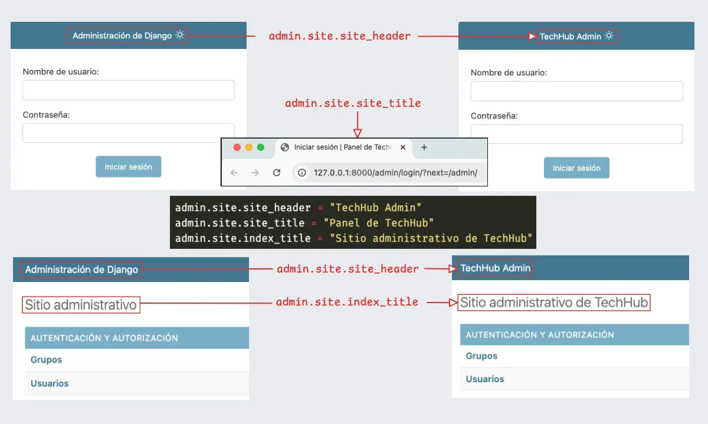

!!! abstract "En resumen"

    Personalizar el **panel de administración de Django** permite adaptar su **idioma, títulos, colores y estilos** a las necesidades del proyecto. Además, es posible utilizar **temas de terceros** como `django-admin-interface` para modificar su apariencia de forma sencilla.
<!-- more -->

Django es conocido por su rapidez en el desarrollo y su potente sistema de administración listo para usarse. Desde el momento en que creas un nuevo proyecto con Django, el panel de administración se configura automáticamente, ofreciendo una interfaz para gestionar modelos, usuarios, permisos y mucho más.

Sin embargo, es común que, a medida que avanzamos en el desarrollo de nuestra aplicación, necesitemos personalizar este panel para adaptarlo a las necesidades específicas de nuestro proyecto. Afortunadamente, Django facilita esta personalización tanto en términos de apariencia como de funcionalidad.

## Setup

### 1. Nuevo proyecto

--8<-- "snippets/nuevo-proyecto.md"

Una vez que hayas creado y configurado tu proyecto, Django incluye un panel administrativo listo para usarse. Sin embargo, para acceder a él, es necesario completar algunos pasos previos:

### 3. Ejecutar Migraciones

```bash title="terminal"
python manage.py migrate
```

### 3. Crear un superusuario

--8<-- "snippets/examples/admin/create-superuser.md"

Una vez que hayas completado el comando con la información requerida, se agregará un nuevo administrador a la base de datos. Ahora, reinicia el servidor de desarrollo para probar el inicio de sesión:

--8<-- "snippets/examples/admin/run-server-after-migrate.md"

## Personalización básica

### 1. Cambio de idioma

Django viene con soporte para múltiples idiomas. En nuestro caso, desearíamos cambiar el idioma del panel administrativo al español. Para ello, debemos realizar lo siguiente.

--8<-- "snippets/grids/django-change-language.md"

### 2. Cambiar títulos

Cuando se ingresa al login del panel de administración, así como al acceder a este, el título que viene por defecto es **«Administración de Django»**, que aparece en la parte superior. Para cambiar este título, se requiere abrir el archivo `urls.py` o un archivo de configuración similar, utilizando las propiedades específicas de `admin.site`: `site_header`, `site_title` e `index_title`.

--8<-- "snippets/grids/django-change-admin-title.md"

La siguiente ilustración muestra un ejemplo de los cambios aplicados, comparando el antes y el después de la configuración.


/// caption
**Figura 2**. Panel de administración antes y después de personalizar sus títulos.
///

### 3. Personalizar paleta de colores

Desde **Django 3.2**, es posible personalizar los colores del panel de administración mediante variables CSS. Para realizar esta modificación, primero debemos crear una plantilla para sobrescribir el estilo del administrador:

???- tip "Añadir un directorio para templates"

    Si el proyecto aún no cuenta con una aplicación, primero debemos crear el directorio `templates/` en la raíz del proyecto y configurarlo en `settings.py` para que Django pueda encontrar las plantillas.

    --8<-- "snippets/grids/django-add-template-dir-root.md"

Para sobrescribir una plantilla del panel administrativo, debemos crearla dentro de `templates/admin/`, manteniendo la misma estructura de directorios utilizada por Django. En este caso, crearemos `base.html`, que reemplazará la plantilla base del administrador.

```{ .plaintext .no-copy title="Estructura de archivos" hl_lines="3-5" }
 ...
├──  _site
├──  templates
│   └──  admin
│       └──  base.html
├──  .venv
└──  manage.py
```

En `base.html`, heredamos la plantilla original del administrador y sobrescribimos el bloque `extrastyle` para definir los colores personalizados:

???+ info "Variables para cada modo"

  Dentro de `:root` se definen las variables utilizadas por defecto. Para controlar los colores de cada tema, Django también permite sobrescribir las variables dentro de los selectores correspondientes al modo claro y oscuro.



```html title="core/templates/admin/base.html" linenums="1"




  <style>

    :root {
      /* Variables generales */
      --primary: #f0c;
      --secondary: #d09;
    }
    html[data-theme="light"] {
      /* Variables del modo claro */
        --primary: rgb(49, 98, 233);
        --secondary: rgb(77, 62, 207);
    }
    html[data-theme="dark"] {
      /* Variables del modo oscuro */
      --primary: rgb(12, 188, 6);
      --secondary: rgb(5, 111, 37);
    }
  </style>

```



**La idea importante:** `:root` actúa como conjunto de valores generales o predeterminados, mientras que `html[data-theme="light"]` y `html[data-theme="dark"]` permiten establecer valores específicos para cada tema.

<video autoplay>
  <source src="../assets/admin/cambiar-variables-de-color.webm" type="video/mp4">
</video>

### 4. Cambiar el logo

Para cambiar el logo del panel administrativo, podemos sobrescribir `admin/base_site.html`. Esta plantilla hereda de `admin/base.html` y permite modificar el bloque `branding`, donde Django muestra el nombre del sitio.

Ahora, debemos crear el archivo en la misma estructura:

```{ .plaintext .no-copy title="Estructura de archivos" hl_lines="3 5" }
 ...
├──  templates
│   └──  admin
│       ├──  base.html
│       └──  base_site.html
├──  _site
├──  .venv
└──  manage.py
```

Luego, en `base_site.html`, cargamos las etiquetas de archivos estáticos y sobrescribimos el bloque `branding`:



```html title="templates/admin/base_site.html" linenums="1"




  <h1 id="site-name">
    <a href="">
      
      Mi sitio web
    </a>
  </h1>

```



En este caso:

1. `` permite conservar la estructura original del administrador.
2. `` habilita el uso de archivos estáticos.
3. El bloque `branding` permite modificar el nombre y el logo mostrados en el encabezado.
4. `` obtiene la ruta del logo desde el directorio de archivos estáticos.

El logo debe ubicarse dentro del directorio configurado para archivos estáticos:

```text
 static
└──  img
    └──  logo.svg
```

La plantilla original `base_site.html` de Django puede consultarse como referencia en el repositorio oficial: [django/contrib/admin/templates/admin/base_site.html](https://github.com/django/django/blob/main/django/contrib/admin/templates/admin/base_site.html?utm_source=chatgpt.com)
