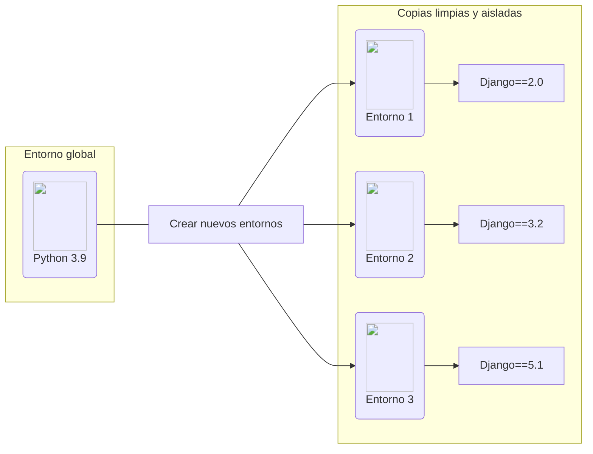

Cuando instalamos [Python3](https://www.python.org/ "Sitio web de Python"){:target='blank'}, se crea un único entorno global compartido por todos los proyectos y todo el código de Python. Aunque es posible instalar [Django](https://www.djangoproject.com/ "Sitio web de Django"){:target=':_blank'} y otros paquetes en el entorno global, esto limita la posibilidad de gestionar múltiples versiones de cada paquete.

!!! warning "Cuidado al trabajar en el entorno global"

    Los paquetes instalados globalmente pueden **generar conflictos entre versiones**, especialmente al trabajar con varios proyectos que requieren diferentes versiones de una misma biblioteca.

Como resultado, los desarrolladores experimentados suelen **configurar y ejecutar** las aplicaciones Python dentro de [entornos virtuales de Python](https://docs.python.org/es/3/tutorial/venv.html){:target='blank' data-preview } independientes.

## Entornos virtuales de Python

Un entorno virtual en Python es una instancia aislada que se crea a partir de una copia de nuestro Python global. Su principal ventaja es que permite trabajar de forma ordenada en un proyecto específico, utilizando únicamente los módulos y librerías necesarios para ese caso, sin afectar a otros proyectos ni a la instalación global del sistema.

A continuación, se muestra un ejemplo de cómo luce un entorno virtual, lo que nos ayudará a comprender mejor su finalidad.



## Crear un entorno virtual

El paquete `venv` ya forma parte de la biblioteca estándar de Python desde la versión 3.5.

Para crear un entorno virtual usando `venv`, ubicate en la carpeta donde quieres crearlo y ejecuta el siguiente comando especificando la ruta a la carpeta:

--8<-- "snippets/commands/python-venv.md"

## Activar el entorno virtual

Una vez creado el entorno virtual, el siguiente paso es ejecutar el script que permite activar el entorno.

La ubicación de los scripts depende de la plataforma en la cual se creó el entorno. Por lo general es:

## Paquetes para Configurar un Entorno Virtual

Una vez instalados Python y pip, contamos con paquetes que nos permiten configurar entornos virtuales. Algunos de estos paquetes vienen integrados con Python, como [`venv`](https://docs.python.org/es/3.13/library/venv.html){:target='_blank'}, mientras que otros, como [`virtualenv`](https://pypi.org/project/virtualenv/){:target='_blank'}, deben instalarse por separado. Ambos nos facilitan la creación de entornos aislados para nuestros proyectos, evitando conflictos entre dependencias.

### **Administrar entornos con `virtualenvwrapper`**

Este paquete es una extensión de `virtualenv` que facilita la gestión y organiza todos tus entornos virtuales en un solo lugar. Para instalarlo, ejecuta el siguiente comando:

=== ":material-apple: macOS"

	```bash title="terminal"
	pip3 install virtualenvwrapper
	```

=== ":simple-linux: Linux"

	```bash title="terminal"
	sudo pip3 install virtualenvwrapper
	```


Ahora, añade las siguientes líneas en el archivo de inicio del shell (`.bashrc` o `.zshrc` si usas [zsh](https://en.wikipedia.org/wiki/Z_shell)):

=== ":octicons-file-code-16: `.bashrc`"
	```bash hl_lines="1 3"
	export WORKON_HOME=$HOME/.virtualenvs # (1)!
	export VIRTUALENVWRAPPER_PYTHON=/usr/bin/python3
	source /usr/local/bin/virtualenvwrapper.sh #(2)!
	```

	1.  La variable `WORKON_HOME` determina en qué directorio se deben crear los entornos virtuales de Python.
	
	2. Por último, se debe agregar esta línea al archivo `~/.bashrc` para especificar en dónde está ubicado el ejecutable de virtualenvwrapper.

#### **Comandos adicionales**

`virtualenvwrapper` agrega varios comandos útiles para gestionar entornos virtuales de manera más eficiente. Algunos de los más utilizados son:

- `mkvirtualenv`: Crea un nuevo entorno virtual.
- `lsvirtualenv`: Muestra todos los entornos virtuales existentes.
- `workon`: Permite activar fácilmente cualquier entorno virtual.
- `rmvirtualenv`: Elimina un entorno virtual.
- `deactivate`: Desactiva el entorno virtual activo.

#### **1. Crear un entorno virtual**

```bash title="terminal"
mkvirtualenv nombre_entorno
```

#### **2. Activar un entorno virtual**


=== "Activar el entorno"

	```bash title="terminal"
	workon django-test
	```
=== "Salida"

	```title="terminal"
	created virtual environment CPython3.9.2.final.0-64 in 9185ms
	  creator CPython3Posix(dest=/home/enidev911/.virtualenvs/django-test, clear=False, no_vcs_ignore=False, global=False)
	  seeder FromAppData(download=False, pip=bundle, setuptools=bundle, wheel=bundle, via=copy, app_data_dir=/home/enidev911/.local/share/virtualenv)
	    added seed packages: pip==24.1, setuptools==70.1.0, wheel==0.43.0
	  activators BashActivator,CShellActivator,FishActivator,NushellActivator,PowerShellActivator,PythonActivator
	virtualenvwrapper.user_scripts creating /home/enidev911/.virtualenvs/django-test/bin/predeactivate
	virtualenvwrapper.user_scripts creating /home/enidev911/.virtualenvs/django-test/bin/postdeactivate
	virtualenvwrapper.user_scripts creating /home/enidev911/.virtualenvs/django-test/bin/preactivate
	virtualenvwrapper.user_scripts creating /home/enidev911/.virtualenvs/django-test/bin/postactivate
	virtualenvwrapper.user_scripts creating /home/enidev911/.virtualenvs/django-test/bin/get_env_detail
	```

#### **3. Eliminar un entorno virtual**


```bash title="bash"
rmvirtualenv nombre_entorno
```
