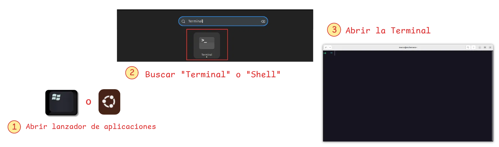

!!! info "1. Abrir la terminal"

    Presiona las teclas ++ctrl+alt+t++ o busca **Terminal** en tu lanzador de aplicaciones para abrir una nueva Terminal.

    
    /// caption
    Abrir Terminal en Linux
    ///
