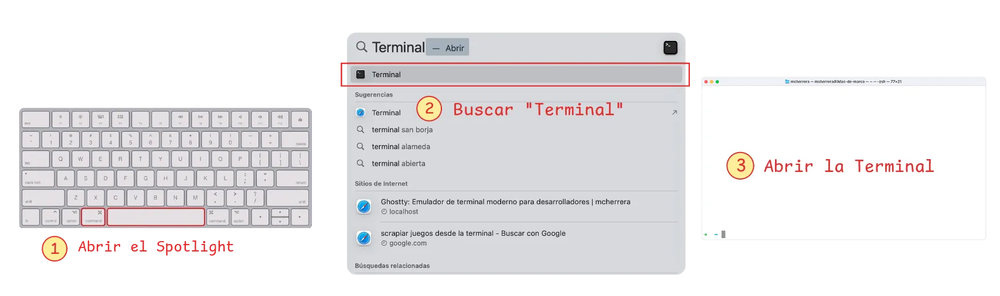

!!! info "1. Abrir la terminal de comandos"

    Presiona ++cmd+space++ para abrir **Spotlight**, luego escribe **terminal** y presiona ++enter++

    
    /// caption
    Abrir Terminal en macOS
    ///
