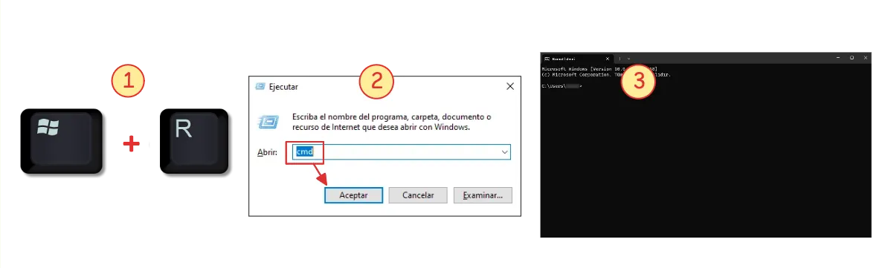

!!! info "1. Abrir el símbolo de sistema"

    Presiona ++win+r++ para abrir la ventana **Ejecutar**.
    Escribe `cmd` y presiona ++enter++ para abrir el **Símbolo del sistema (CMD)**.

    
    /// caption
    Abrir el símbolo del sistema (CMD)
    ///
